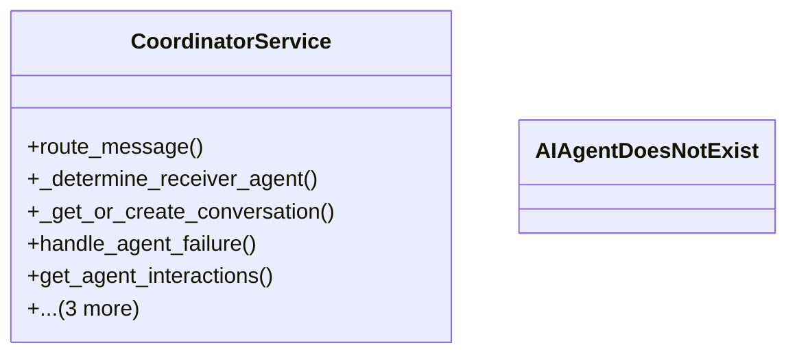

# integration_modules.ai_a2a.services.coordinator_service

## Imports
- ai_agents.models
- django.db
- django.utils
- logging
- models

## Classes
- CoordinatorService
  - method: `route_message`
  - method: `_determine_receiver_agent`
  - method: `_get_or_create_conversation`
  - method: `handle_agent_failure`
  - method: `get_agent_interactions`
  - method: `broadcast_message`
  - method: `register_agent`
  - method: `update_agent_status`
- AIAgentDoesNotExist

## Functions
- route_message
- _determine_receiver_agent
- _get_or_create_conversation
- handle_agent_failure
- get_agent_interactions
- broadcast_message
- register_agent
- update_agent_status

## Module Variables
- `logger`

## Class Diagram

