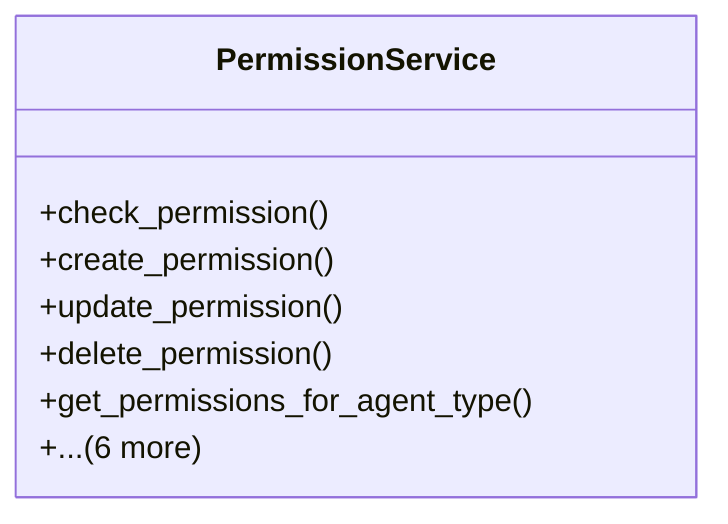

# integration_modules.ai_a2a.services.permission_service

## Imports
- core_modules.activity_log.models
- django.contrib.auth
- django.core.exceptions
- django.db
- django.utils
- models

## Classes
- PermissionService
  - method: `check_permission`
  - method: `create_permission`
  - method: `update_permission`
  - method: `delete_permission`
  - method: `get_permissions_for_agent_type`
  - method: `get_required_approvals`
  - method: `create_approval_request`
  - method: `approve_request`
  - method: `reject_request`
  - method: `get_pending_approvals`
  - method: `_log_activity`

## Functions
- check_permission
- create_permission
- update_permission
- delete_permission
- get_permissions_for_agent_type
- get_required_approvals
- create_approval_request
- approve_request
- reject_request
- get_pending_approvals
- _log_activity

## Module Variables
- `User`

## Class Diagram

