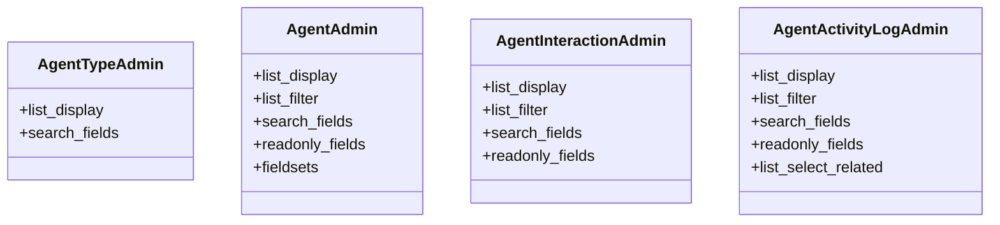

# integration_modules.ai_agent.admin

## Imports
- django.contrib
- models

## Classes
- AgentTypeAdmin
  - attr: `list_display`
  - attr: `search_fields`
- AgentAdmin
  - attr: `list_display`
  - attr: `list_filter`
  - attr: `search_fields`
  - attr: `readonly_fields`
  - attr: `fieldsets`
- AgentInteractionAdmin
  - attr: `list_display`
  - attr: `list_filter`
  - attr: `search_fields`
  - attr: `readonly_fields`
- AgentActivityLogAdmin
  - attr: `list_display`
  - attr: `list_filter`
  - attr: `search_fields`
  - attr: `readonly_fields`
  - attr: `list_select_related`

## Class Diagram

