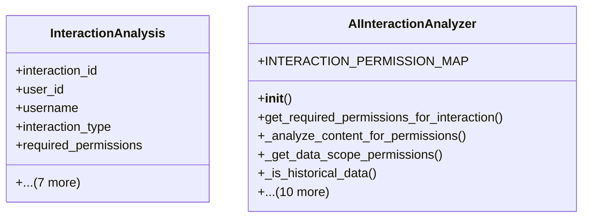

# integration_modules.ai_agent.analysis_service

## Imports
- collections
- dataclasses
- datetime
- django.contrib.auth
- django.core.exceptions
- django.db
- django.utils
- logging
- models
- shared.permissions.services
- typing

## Classes
- InteractionAnalysis
  - attr: `interaction_id`
  - attr: `user_id`
  - attr: `username`
  - attr: `interaction_type`
  - attr: `required_permissions`
  - attr: `has_permissions`
  - attr: `missing_permissions`
  - attr: `analysis_notes`
  - attr: `risk_level`
  - attr: `compliance_status`
  - attr: `timestamp`
  - attr: `additional_data`
- AIInteractionAnalyzer
  - attr: `INTERACTION_PERMISSION_MAP`
  - method: `__init__`
  - method: `get_required_permissions_for_interaction`
  - method: `_analyze_content_for_permissions`
  - method: `_get_data_scope_permissions`
  - method: `_is_historical_data`
  - method: `_contains_pii_request`
  - method: `analyze_interaction_permissions`
  - method: `_perform_security_analysis`
  - method: `_is_unusual_access_pattern`
  - method: `_check_data_exfiltration_risk`
  - method: `_is_after_hours_access`
  - method: `_is_sensitive_interaction`
  - method: `_is_cross_department_access`
  - method: `bulk_analyze_interactions`
  - method: `generate_compliance_report`

## Functions
- get_required_permissions_for_interaction
- analyze_interaction_permissions
- __init__
- get_required_permissions_for_interaction
- _analyze_content_for_permissions
- _get_data_scope_permissions
- _is_historical_data
- _contains_pii_request
- analyze_interaction_permissions
- _perform_security_analysis
- _is_unusual_access_pattern
- _check_data_exfiltration_risk
- _is_after_hours_access
- _is_sensitive_interaction
- _is_cross_department_access
- bulk_analyze_interactions
- generate_compliance_report

## Module Variables
- `User`
- `logger`

## Class Diagram

