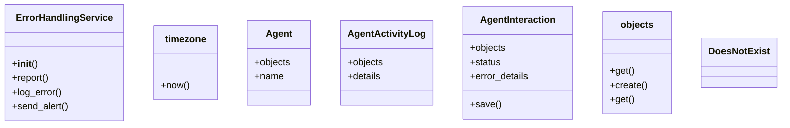

# integration_modules.ai_agent.error_service

## Imports
- datetime
- django.utils
- logging
- models.activity_logs
- models.agents
- models.interactions
- traceback
- typing

## Classes
- ErrorHandlingService
  - method: `__init__`
  - method: `report`
  - method: `log_error`
  - method: `send_alert`
- timezone
  - method: `now`
- Agent
  - attr: `objects`
  - attr: `name`
- AgentActivityLog
  - attr: `objects`
  - attr: `details`
- AgentInteraction
  - attr: `objects`
  - attr: `status`
  - attr: `error_details`
  - method: `save`
- objects
  - method: `get`
- DoesNotExist
- objects
  - method: `create`
- objects
  - method: `get`
- DoesNotExist

## Functions
- log_agent_error
- send_admin_alert
- report_error
- is_error_handling_available
- get_error_service
- __init__
- report
- log_error
- send_alert
- now
- save
- get
- create
- get

## Module Variables
- `logger`
- `__all__`

## Class Diagram

