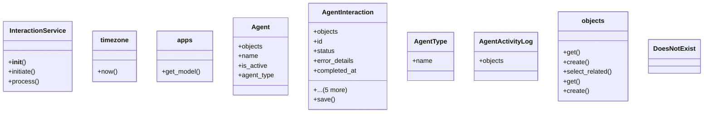

# integration_modules.ai_agent.interaction_service

## Imports
- datetime
- django.apps
- django.utils
- error_service
- logging
- models
- models.activity_logs
- models.agents
- models.interactions
- traceback
- typing
- uuid

## Classes
- InteractionService
  - method: `__init__`
  - method: `initiate`
  - method: `process`
- timezone
  - method: `now`
- apps
  - method: `get_model`
- Agent
  - attr: `objects`
  - attr: `name`
  - attr: `is_active`
  - attr: `agent_type`
- AgentInteraction
  - attr: `objects`
  - attr: `id`
  - attr: `status`
  - attr: `error_details`
  - attr: `completed_at`
  - attr: `response_content`
  - attr: `initiating_agent`
  - attr: `responding_agent`
  - attr: `interaction_type`
  - attr: `content`
  - method: `save`
- AgentType
  - attr: `name`
- AgentActivityLog
  - attr: `objects`
- objects
  - method: `get`
- DoesNotExist
- objects
  - method: `create`
  - method: `select_related`
  - method: `get`
- DoesNotExist
- objects
  - method: `create`

## Functions
- initiate_interaction
- process_interaction
- is_interaction_service_available
- get_interaction_service
- __init__
- initiate
- process
- now
- get_model
- save
- get
- create
- select_related
- get
- create

## Module Variables
- `logger`
- `__all__`

## Class Diagram

