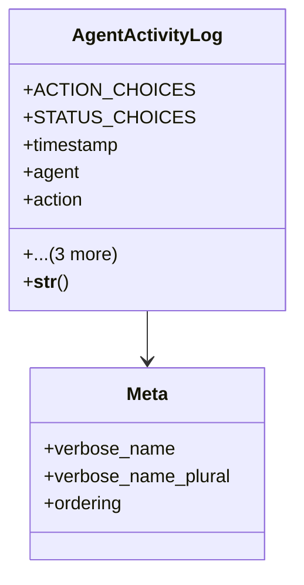

# integration_modules.ai_agent.models.activity_logs

## Imports
- agents
- django.db
- django.utils
- django.utils.translation
- interactions

## Classes
- AgentActivityLog
  - attr: `ACTION_CHOICES`
  - attr: `STATUS_CHOICES`
  - attr: `timestamp`
  - attr: `agent`
  - attr: `action`
  - attr: `status`
  - attr: `related_interaction`
  - attr: `details`
  - method: `__str__`
- Meta
  - attr: `verbose_name`
  - attr: `verbose_name_plural`
  - attr: `ordering`

## Functions
- __str__

## Class Diagram

