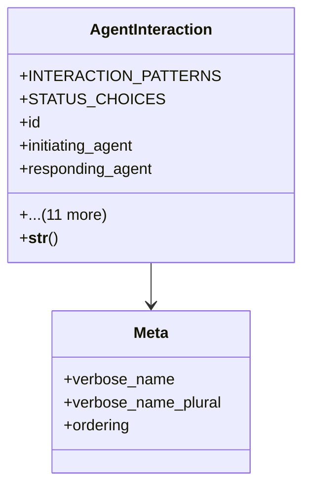

# integration_modules.ai_agent.models.interactions

## Imports
- agents
- django.db
- django.utils
- django.utils.translation
- uuid

## Classes
- AgentInteraction
  - attr: `INTERACTION_PATTERNS`
  - attr: `STATUS_CHOICES`
  - attr: `id`
  - attr: `initiating_agent`
  - attr: `responding_agent`
  - attr: `interaction_type`
  - attr: `interaction_pattern`
  - attr: `correlation_id`
  - attr: `content`
  - attr: `response_content`
  - attr: `status`
  - attr: `error_details`
  - attr: `retry_count`
  - attr: `created_at`
  - attr: `updated_at`
  - attr: `completed_at`
  - method: `__str__`
- Meta
  - attr: `verbose_name`
  - attr: `verbose_name_plural`
  - attr: `ordering`

## Functions
- __str__

## Class Diagram

