# integration_modules.ai_agent.models

## Imports
- django.conf
- django.core.exceptions
- django.db
- django.utils
- django.utils.translation
- uuid

## Classes
- BaseModel
  - attr: `created_at`
  - attr: `updated_at`
  - attr: `created_by`
  - attr: `updated_by`
  - attr: `is_active`
- Agent
  - attr: `AGENT_TYPES`
  - attr: `AGENT_STATUS`
  - attr: `id`
  - attr: `name`
  - attr: `description`
  - attr: `agent_type`
  - attr: `status`
  - attr: `owner`
  - attr: `avatar`
  - attr: `ai_model`
  - attr: `system_prompt`
  - attr: `capabilities`
  - attr: `config`
  - attr: `memory_enabled`
  - attr: `last_active`
  - method: `__str__`
  - method: `clean`
  - method: `activate`
  - method: `deactivate`
  - method: `suspend`
  - method: `update_last_active`
- AgentRole
  - attr: `name`
  - attr: `description`
  - attr: `permissions`
  - attr: `is_system_role`
  - method: `__str__`
- AgentRoleAssignment
  - attr: `agent`
  - attr: `role`
  - attr: `assigned_by`
  - attr: `assigned_at`
  - attr: `expires_at`
  - attr: `is_active`
  - method: `__str__`
  - method: `clean`
- AgentMessage
  - attr: `MESSAGE_TYPES`
  - attr: `id`
  - attr: `conversation`
  - attr: `message_type`
  - attr: `sender`
  - attr: `agent`
  - attr: `content`
  - attr: `timestamp`
  - attr: `metadata`
  - attr: `tokens_used`
  - attr: `parent_message`
  - method: `__str__`
- AgentConversation
  - attr: `CONVERSATION_TYPES`
  - attr: `CONVERSATION_STATUS`
  - attr: `id`
  - attr: `title`
  - attr: `conversation_type`
  - attr: `status`
  - attr: `creator`
  - attr: `participants`
  - attr: `agents`
  - attr: `created_at`
  - attr: `updated_at`
  - attr: `metadata`
  - attr: `memory_key`
  - method: `__str__`
  - method: `archive`
  - method: `delete_conversation`
  - method: `add_message`
- AgentConversationParticipant
  - attr: `conversation`
  - attr: `user`
  - attr: `joined_at`
  - attr: `is_active`
  - attr: `last_read_message`
  - attr: `permissions`
  - method: `__str__`
- AgentConversationAgent
  - attr: `conversation`
  - attr: `agent`
  - attr: `joined_at`
  - attr: `is_active`
  - attr: `role`
  - attr: `permissions`
  - method: `__str__`
- AgentTask
  - attr: `TASK_STATUS`
  - attr: `TASK_PRIORITY`
  - attr: `id`
  - attr: `title`
  - attr: `description`
  - attr: `agent`
  - attr: `creator`
  - attr: `status`
  - attr: `priority`
  - attr: `created_at`
  - attr: `started_at`
  - attr: `completed_at`
  - attr: `due_date`
  - attr: `parameters`
  - attr: `result`
  - attr: `error_message`
  - attr: `conversation`
  - method: `__str__`
  - method: `start`
  - method: `complete`
  - method: `fail`
  - method: `cancel`
- AgentWorkflow
  - attr: `WORKFLOW_STATUS`
  - attr: `name`
  - attr: `description`
  - attr: `status`
  - attr: `creator`
  - attr: `agents`
  - attr: `workflow_definition`
  - attr: `version`
  - attr: `is_template`
  - method: `__str__`
  - method: `activate`
  - method: `deactivate`
  - method: `archive`
  - method: `create_new_version`
- AgentWorkflowStep
  - attr: `STEP_TYPES`
  - attr: `workflow`
  - attr: `agent`
  - attr: `step_order`
  - attr: `step_type`
  - attr: `step_config`
  - method: `__str__`
- AgentWorkflowExecution
  - attr: `EXECUTION_STATUS`
  - attr: `id`
  - attr: `workflow`
  - attr: `initiator`
  - attr: `status`
  - attr: `started_at`
  - attr: `completed_at`
  - attr: `current_step`
  - attr: `input_data`
  - attr: `output_data`
  - attr: `error_message`
  - attr: `conversation`
  - method: `__str__`
  - method: `start`
  - method: `complete`
  - method: `fail`
  - method: `cancel`
- AgentWorkflowStepExecution
  - attr: `STEP_EXECUTION_STATUS`
  - attr: `id`
  - attr: `workflow_execution`
  - attr: `step`
  - attr: `status`
  - attr: `started_at`
  - attr: `completed_at`
  - attr: `input_data`
  - attr: `output_data`
  - attr: `error_message`
  - attr: `execution_time_ms`
  - method: `__str__`
  - method: `start`
  - method: `complete`
  - method: `fail`
  - method: `skip`
- Meta
  - attr: `app_label`
  - attr: `abstract`
- Meta
  - attr: `app_label`
  - attr: `verbose_name`
  - attr: `verbose_name_plural`
  - attr: `ordering`
  - attr: `indexes`
- Meta
  - attr: `app_label`
  - attr: `verbose_name`
  - attr: `verbose_name_plural`
  - attr: `ordering`
- Meta
  - attr: `app_label`
  - attr: `verbose_name`
  - attr: `verbose_name_plural`
  - attr: `ordering`
  - attr: `unique_together`
  - attr: `indexes`
- Meta
  - attr: `app_label`
  - attr: `verbose_name`
  - attr: `verbose_name_plural`
  - attr: `ordering`
  - attr: `indexes`
- Meta
  - attr: `app_label`
  - attr: `verbose_name`
  - attr: `verbose_name_plural`
  - attr: `ordering`
  - attr: `indexes`
- Meta
  - attr: `app_label`
  - attr: `verbose_name`
  - attr: `verbose_name_plural`
  - attr: `ordering`
  - attr: `unique_together`
  - attr: `indexes`
- Meta
  - attr: `app_label`
  - attr: `verbose_name`
  - attr: `verbose_name_plural`
  - attr: `ordering`
  - attr: `unique_together`
  - attr: `indexes`
- Meta
  - attr: `app_label`
  - attr: `verbose_name`
  - attr: `verbose_name_plural`
  - attr: `ordering`
  - attr: `indexes`
- Meta
  - attr: `app_label`
  - attr: `verbose_name`
  - attr: `verbose_name_plural`
  - attr: `ordering`
  - attr: `indexes`
- Meta
  - attr: `app_label`
  - attr: `verbose_name`
  - attr: `verbose_name_plural`
  - attr: `ordering`
  - attr: `unique_together`
  - attr: `indexes`
- Meta
  - attr: `app_label`
  - attr: `verbose_name`
  - attr: `verbose_name_plural`
  - attr: `ordering`
  - attr: `indexes`
- Meta
  - attr: `app_label`
  - attr: `verbose_name`
  - attr: `verbose_name_plural`
  - attr: `ordering`
  - attr: `indexes`

## Functions
- __str__
- clean
- activate
- deactivate
- suspend
- update_last_active
- __str__
- __str__
- clean
- __str__
- __str__
- archive
- delete_conversation
- add_message
- __str__
- __str__
- __str__
- start
- complete
- fail
- cancel
- __str__
- activate
- deactivate
- archive
- create_new_version
- __str__
- __str__
- start
- complete
- fail
- cancel
- __str__
- start
- complete
- fail
- skip

## Class Diagram

```mermaid
classDiagram
    class BaseModel {
        +created_at
        +updated_at
        +created_by
        +updated_by
        +is_active
    }
    class Agent {
        +AGENT_TYPES
        +AGENT_STATUS
        +id
        +name
        +description
        +... (10 more)
        +__str__()
        +clean()
        +activate()
        +deactivate()
        +suspend()
        +... (1 more)
    }
    class AgentRole {
        +name
        +description
        +permissions
        +is_system_role
        +__str__()
    }
    class AgentRoleAssignment {
        +agent
        +role
        +assigned_by
        +assigned_at
        +expires_at
        +... (1 more)
        +__str__()
        +clean()
    }
    class AgentMessage {
        +MESSAGE_TYPES
        +id
        +conversation
        +message_type
        +sender
        +... (6 more)
        +__str__()
    }
    class AgentConversation {
        +CONVERSATION_TYPES
        +CONVERSATION_STATUS
        +id
        +title
        +conversation_type
        +... (8 more)
        +__str__()
        +archive()
        +delete_conversation()
        +add_message()
    }
    class AgentConversationParticipant {
        +conversation
        +user
        +joined_at
        +is_active
        +last_read_message
        +... (1 more)
        +__str__()
    }
    class AgentConversationAgent {
        +conversation
        +agent
        +joined_at
        +is_active
        +role
        +... (1 more)
        +__str__()
    }
    class AgentTask {
        +TASK_STATUS
        +TASK_PRIORITY
        +id
        +title
        +description
        +... (12 more)
        +__str__()
        +start()
        +complete()
        +fail()
        +cancel()
    }
    class AgentWorkflow {
        +WORKFLOW_STATUS
        +name
        +description
        +status
        +creator
        +... (4 more)
        +__str__()
        +activate()
        +deactivate()
        +archive()
        +create_new_version()
    }
    class AgentWorkflowStep {
        +STEP_TYPES
        +workflow
        +agent
        +step_order
        +step_type
        +... (1 more)
        +__str__()
    }
    class AgentWorkflowExecution {
        +EXECUTION_STATUS
        +id
        +workflow
        +initiator
        +status
        +... (7 more)
        +__str__()
        +start()
        +complete()
        +fail()
        +cancel()
    }
    class AgentWorkflowStepExecution {
        +STEP_EXECUTION_STATUS
        +id
        +workflow_execution
        +step
        +status
        +... (6 more)
        +__str__()
        +start()
        +complete()
        +fail()
        +skip()
    }
    class Meta {
        +app_label
        +abstract
    }
    class Meta {
        +app_label
        +verbose_name
        +verbose_name_plural
        +ordering
        +indexes
    }
    class Meta {
        +app_label
        +verbose_name
        +verbose_name_plural
        +ordering
    }
    class Meta {
        +app_label
        +verbose_name
        +verbose_name_plural
        +ordering
        +unique_together
        +... (1 more)
    }
    class Meta {
        +app_label
        +verbose_name
        +verbose_name_plural
        +ordering
        +indexes
    }
    class Meta {
        +app_label
        +verbose_name
        +verbose_name_plural
        +ordering
        +indexes
    }
    class Meta {
        +app_label
        +verbose_name
        +verbose_name_plural
        +ordering
        +unique_together
        +... (1 more)
    }
    class Meta {
        +app_label
        +verbose_name
        +verbose_name_plural
        +ordering
        +unique_together
        +... (1 more)
    }
    class Meta {
        +app_label
        +verbose_name
        +verbose_name_plural
        +ordering
        +indexes
    }
    class Meta {
        +app_label
        +verbose_name
        +verbose_name_plural
        +ordering
        +indexes
    }
    class Meta {
        +app_label
        +verbose_name
        +verbose_name_plural
        +ordering
        +unique_together
        +... (1 more)
    }
    class Meta {
        +app_label
        +verbose_name
        +verbose_name_plural
        +ordering
        +indexes
    }
    class Meta {
        +app_label
        +verbose_name
        +verbose_name_plural
        +ordering
        +indexes
    }
    BaseModel --> Meta
    BaseModel --> Meta
    BaseModel --> Meta
    BaseModel --> Meta
    BaseModel --> Meta
    BaseModel --> Meta
    BaseModel --> Meta
    BaseModel --> Meta
    BaseModel --> Meta
    BaseModel --> Meta
    BaseModel --> Meta
    BaseModel --> Meta
    BaseModel --> Meta
    Agent --> Meta
    Agent --> Meta
    Agent --> Meta
    Agent --> Meta
    Agent --> Meta
    Agent --> Meta
    Agent --> Meta
    Agent --> Meta
    Agent --> Meta
    Agent --> Meta
    Agent --> Meta
    Agent --> Meta
    Agent --> Meta
    AgentRole --> Meta
    AgentRole --> Meta
    AgentRole --> Meta
    AgentRole --> Meta
    AgentRole --> Meta
    AgentRole --> Meta
    AgentRole --> Meta
    AgentRole --> Meta
    AgentRole --> Meta
    AgentRole --> Meta
    AgentRole --> Meta
    AgentRole --> Meta
    AgentRole --> Meta
    AgentRoleAssignment --> Meta
    AgentRoleAssignment --> Meta
    AgentRoleAssignment --> Meta
    AgentRoleAssignment --> Meta
    AgentRoleAssignment --> Meta
    AgentRoleAssignment --> Meta
    AgentRoleAssignment --> Meta
    AgentRoleAssignment --> Meta
    AgentRoleAssignment --> Meta
    AgentRoleAssignment --> Meta
    AgentRoleAssignment --> Meta
    AgentRoleAssignment --> Meta
    AgentRoleAssignment --> Meta
    AgentMessage --> Meta
    AgentMessage --> Meta
    AgentMessage --> Meta
    AgentMessage --> Meta
    AgentMessage --> Meta
    AgentMessage --> Meta
    AgentMessage --> Meta
    AgentMessage --> Meta
    AgentMessage --> Meta
    AgentMessage --> Meta
    AgentMessage --> Meta
    AgentMessage --> Meta
    AgentMessage --> Meta
    AgentConversation --> Meta
    AgentConversation --> Meta
    AgentConversation --> Meta
    AgentConversation --> Meta
    AgentConversation --> Meta
    AgentConversation --> Meta
    AgentConversation --> Meta
    AgentConversation --> Meta
    AgentConversation --> Meta
    AgentConversation --> Meta
    AgentConversation --> Meta
    AgentConversation --> Meta
    AgentConversation --> Meta
    AgentConversationParticipant --> Meta
    AgentConversationParticipant --> Meta
    AgentConversationParticipant --> Meta
    AgentConversationParticipant --> Meta
    AgentConversationParticipant --> Meta
    AgentConversationParticipant --> Meta
    AgentConversationParticipant --> Meta
    AgentConversationParticipant --> Meta
    AgentConversationParticipant --> Meta
    AgentConversationParticipant --> Meta
    AgentConversationParticipant --> Meta
    AgentConversationParticipant --> Meta
    AgentConversationParticipant --> Meta
    AgentConversationAgent --> Meta
    AgentConversationAgent --> Meta
    AgentConversationAgent --> Meta
    AgentConversationAgent --> Meta
    AgentConversationAgent --> Meta
    AgentConversationAgent --> Meta
    AgentConversationAgent --> Meta
    AgentConversationAgent --> Meta
    AgentConversationAgent --> Meta
    AgentConversationAgent --> Meta
    AgentConversationAgent --> Meta
    AgentConversationAgent --> Meta
    AgentConversationAgent --> Meta
    AgentTask --> Meta
    AgentTask --> Meta
    AgentTask --> Meta
    AgentTask --> Meta
    AgentTask --> Meta
    AgentTask --> Meta
    AgentTask --> Meta
    AgentTask --> Meta
    AgentTask --> Meta
    AgentTask --> Meta
    AgentTask --> Meta
    AgentTask --> Meta
    AgentTask --> Meta
    AgentWorkflow --> Meta
    AgentWorkflow --> Meta
    AgentWorkflow --> Meta
    AgentWorkflow --> Meta
    AgentWorkflow --> Meta
    AgentWorkflow --> Meta
    AgentWorkflow --> Meta
    AgentWorkflow --> Meta
    AgentWorkflow --> Meta
    AgentWorkflow --> Meta
    AgentWorkflow --> Meta
    AgentWorkflow --> Meta
    AgentWorkflow --> Meta
    AgentWorkflowStep --> Meta
    AgentWorkflowStep --> Meta
    AgentWorkflowStep --> Meta
    AgentWorkflowStep --> Meta
    AgentWorkflowStep --> Meta
    AgentWorkflowStep --> Meta
    AgentWorkflowStep --> Meta
    AgentWorkflowStep --> Meta
    AgentWorkflowStep --> Meta
    AgentWorkflowStep --> Meta
    AgentWorkflowStep --> Meta
    AgentWorkflowStep --> Meta
    AgentWorkflowStep --> Meta
    AgentWorkflowExecution --> Meta
    AgentWorkflowExecution --> Meta
    AgentWorkflowExecution --> Meta
    AgentWorkflowExecution --> Meta
    AgentWorkflowExecution --> Meta
    AgentWorkflowExecution --> Meta
    AgentWorkflowExecution --> Meta
    AgentWorkflowExecution --> Meta
    AgentWorkflowExecution --> Meta
    AgentWorkflowExecution --> Meta
    AgentWorkflowExecution --> Meta
    AgentWorkflowExecution --> Meta
    AgentWorkflowExecution --> Meta
    AgentWorkflowStepExecution --> Meta
    AgentWorkflowStepExecution --> Meta
    AgentWorkflowStepExecution --> Meta
    AgentWorkflowStepExecution --> Meta
    AgentWorkflowStepExecution --> Meta
    AgentWorkflowStepExecution --> Meta
    AgentWorkflowStepExecution --> Meta
    AgentWorkflowStepExecution --> Meta
    AgentWorkflowStepExecution --> Meta
    AgentWorkflowStepExecution --> Meta
    AgentWorkflowStepExecution --> Meta
    AgentWorkflowStepExecution --> Meta
    AgentWorkflowStepExecution --> Meta
```

