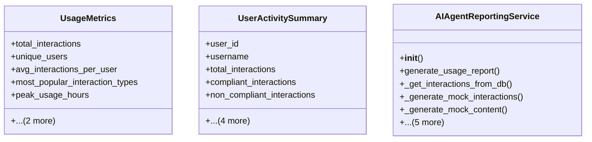

# integration_modules.ai_agent.reporting_service

## Imports
- analysis_service
- collections
- dataclasses
- datetime
- django.contrib.auth
- django.core.paginator
- django.db
- django.db.models
- django.utils
- json
- logging
- models
- random
- typing
- uuid

## Classes
- UsageMetrics
  - attr: `total_interactions`
  - attr: `unique_users`
  - attr: `avg_interactions_per_user`
  - attr: `most_popular_interaction_types`
  - attr: `peak_usage_hours`
  - attr: `compliance_rate`
  - attr: `risk_distribution`
- UserActivitySummary
  - attr: `user_id`
  - attr: `username`
  - attr: `total_interactions`
  - attr: `compliant_interactions`
  - attr: `non_compliant_interactions`
  - attr: `risk_score`
  - attr: `most_used_interaction_types`
  - attr: `last_interaction_date`
  - attr: `compliance_rate`
- AIAgentReportingService
  - method: `__init__`
  - method: `generate_usage_report`
  - method: `_get_interactions_from_db`
  - method: `_generate_mock_interactions`
  - method: `_generate_mock_content`
  - method: `get_usage_metrics`
  - method: `get_user_activity_summary`
  - method: `get_compliance_dashboard_data`
  - method: `export_audit_report`
  - method: `_generate_recommendations`

## Functions
- generate_usage_report
- get_compliance_dashboard_data
- __init__
- generate_usage_report
- _get_interactions_from_db
- _generate_mock_interactions
- _generate_mock_content
- get_usage_metrics
- get_user_activity_summary
- get_compliance_dashboard_data
- export_audit_report
- _generate_recommendations

## Module Variables
- `User`
- `logger`

## Class Diagram

