# integration_modules.ai_agent.services

## Imports
- celery
- celery.exceptions
- contextlib
- dataclasses
- datetime
- django.conf
- django.contrib.auth
- django.core.cache
- django.core.exceptions
- django.db
- django.utils
- django_redis
- enum
- json
- logging
- models
- permissions
- random
- redis
- signal
- time
- traceback
- typing
- uuid

## Classes
- InteractionStatus
  - attr: `QUEUED`
  - attr: `PROCESSING`
  - attr: `COMPLETED`
  - attr: `FAILED`
  - attr: `CANCELLED`
  - attr: `RETRY`
  - attr: `TIMEOUT`
- AgentType
  - attr: `SYSTEM`
  - attr: `USER`
  - attr: `ERROR_HANDLER`
  - attr: `ORCHESTRATOR`
  - attr: `WORKER`
  - attr: `MONITOR`
  - attr: `SPECIALIZED`
- Priority
  - attr: `LOW`
  - attr: `NORMAL`
  - attr: `HIGH`
  - attr: `URGENT`
  - attr: `CRITICAL`
- InteractionResult
  - attr: `success`
  - attr: `data`
  - attr: `error`
  - attr: `status`
  - attr: `execution_time`
  - attr: `metadata`
- MockRedis
  - method: `__init__`
  - method: `ping`
  - method: `get`
  - method: `set`
  - method: `setex`
  - method: `delete`
- _DummyContext
  - method: `__enter__`
  - method: `__exit__`
- AgentServiceError
- AgentNotFoundError
- PermissionError
- InteractionError
- AgentLogicDispatcher
  - method: `__init__`
  - method: `_register_default_handlers`
  - method: `register_handler`
  - method: `dispatch`
  - method: `_default_handler`
  - method: `_handle_error_report`
  - method: `_handle_orchestration_start`
  - method: `_handle_worker_task`
  - method: `_handle_monitor_check`
  - method: `_find_suitable_workers`
  - method: `_create_subtasks`
  - method: `_create_subtask_interaction`
  - method: `_simulate_task_execution`
  - method: `_perform_monitoring_check`
  - method: `_notify_admin`
- SharedMemoryManager
  - method: `__init__`
  - method: `_initialize_redis`
  - method: `set_data`
  - method: `get_data`
  - method: `delete_data`
  - method: `_check_memory_permission`
- timezone
  - method: `now`
- transaction
  - method: `atomic`
- PermissionDenied
- ObjectDoesNotExist
- ValidationError
- cache
  - method: `get`
  - method: `set`
- Retry
- redis
- Agent
  - method: `__init__`
  - method: `is_active`
- Message
  - method: `__init__`
  - method: `save`
- AgentActivity
  - method: `log_activity`
- ErrorLog
  - method: `log_error`
- AgentCapability
- AgentPermissionManager
  - method: `has_permission`
  - method: `check_agent_permission`
- User
  - method: `__init__`
- exceptions
- objects
  - method: `get`
  - method: `filter`
  - method: `first`
- DoesNotExist
- objects
  - method: `create`
- DoesNotExist
- ConnectionError
- RedisError

## Functions
- call_actual_agent_logic
- _execute_with_timeout
- log_ai_activity
- _serialize_target
- initiate_agent_interaction
- _validate_agent
- process_agent_interaction
- _get_interaction
- _update_interaction_status
- get_agent_by_id
- get_active_agents
- register_agent_handler
- is_service_healthy
- __init__
- ping
- get
- set
- setex
- delete
- __enter__
- __exit__
- __init__
- _register_default_handlers
- register_handler
- dispatch
- _default_handler
- _handle_error_report
- _handle_orchestration_start
- _handle_worker_task
- _handle_monitor_check
- _find_suitable_workers
- _create_subtasks
- _create_subtask_interaction
- _simulate_task_execution
- _perform_monitoring_check
- _notify_admin
- timeout_handler
- __init__
- _initialize_redis
- set_data
- get_data
- delete_data
- _check_memory_permission
- get_user_model
- get_redis_connection
- shared_task
- now
- atomic
- get
- set
- decorator
- __init__
- is_active
- __init__
- save
- log_activity
- log_error
- has_permission
- check_agent_permission
- __init__
- get
- filter
- first
- create

## Module Variables
- `logger`
- `User`
- `dispatcher`
- `memory_manager`
- `__all__`

## Class Diagram

```mermaid
classDiagram
    class InteractionStatus {
        +QUEUED
        +PROCESSING
        +COMPLETED
        +FAILED
        +CANCELLED
        +... (2 more)
    }
    class AgentType {
        +SYSTEM
        +USER
        +ERROR_HANDLER
        +ORCHESTRATOR
        +WORKER
        +... (2 more)
    }
    class Priority {
        +LOW
        +NORMAL
        +HIGH
        +URGENT
        +CRITICAL
    }
    class InteractionResult {
        +success
        +data
        +error
        +status
        +execution_time
        +... (1 more)
    }
    class MockRedis {
        +__init__()
        +ping()
        +get()
        +set()
        +setex()
        +... (1 more)
    }
    class _DummyContext {
        +__enter__()
        +__exit__()
    }
    class AgentServiceError {
    }
    class AgentNotFoundError {
    }
    class PermissionError {
    }
    class InteractionError {
    }
    class AgentLogicDispatcher {
        +__init__()
        +_register_default_handlers()
        +register_handler()
        +dispatch()
        +_default_handler()
        +... (10 more)
    }
    class SharedMemoryManager {
        +__init__()
        +_initialize_redis()
        +set_data()
        +get_data()
        +delete_data()
        +... (1 more)
    }
    class timezone {
        +now()
    }
    class transaction {
        +atomic()
    }
    class PermissionDenied {
    }
    class ObjectDoesNotExist {
    }
    class ValidationError {
    }
    class cache {
        +get()
        +set()
    }
    class Retry {
    }
    class redis {
    }
    class Agent {
        +__init__()
        +is_active()
    }
    class Message {
        +__init__()
        +save()
    }
    class AgentActivity {
        +log_activity()
    }
    class ErrorLog {
        +log_error()
    }
    class AgentCapability {
    }
    class AgentPermissionManager {
        +has_permission()
        +check_agent_permission()
    }
    class User {
        +__init__()
    }
    class exceptions {
    }
    class objects {
        +get()
        +filter()
        +first()
    }
    class DoesNotExist {
    }
    class objects {
        +create()
    }
    class DoesNotExist {
    }
    class ConnectionError {
    }
    class RedisError {
    }
```

