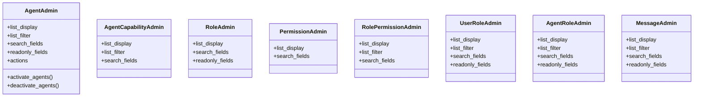

# integration_modules.ai_agents.admin

## Imports
- django.contrib
- models

## Classes
- AgentAdmin
  - attr: `list_display`
  - attr: `list_filter`
  - attr: `search_fields`
  - attr: `readonly_fields`
  - attr: `actions`
  - method: `activate_agents`
  - method: `deactivate_agents`
- AgentCapabilityAdmin
  - attr: `list_display`
  - attr: `list_filter`
  - attr: `search_fields`
- RoleAdmin
  - attr: `list_display`
  - attr: `search_fields`
  - attr: `readonly_fields`
- PermissionAdmin
  - attr: `list_display`
  - attr: `search_fields`
- RolePermissionAdmin
  - attr: `list_display`
  - attr: `list_filter`
  - attr: `search_fields`
- UserRoleAdmin
  - attr: `list_display`
  - attr: `list_filter`
  - attr: `search_fields`
  - attr: `readonly_fields`
- AgentRoleAdmin
  - attr: `list_display`
  - attr: `list_filter`
  - attr: `search_fields`
  - attr: `readonly_fields`
- MessageAdmin
  - attr: `list_display`
  - attr: `list_filter`
  - attr: `search_fields`
  - attr: `readonly_fields`

## Functions
- activate_agents
- deactivate_agents

## Class Diagram

