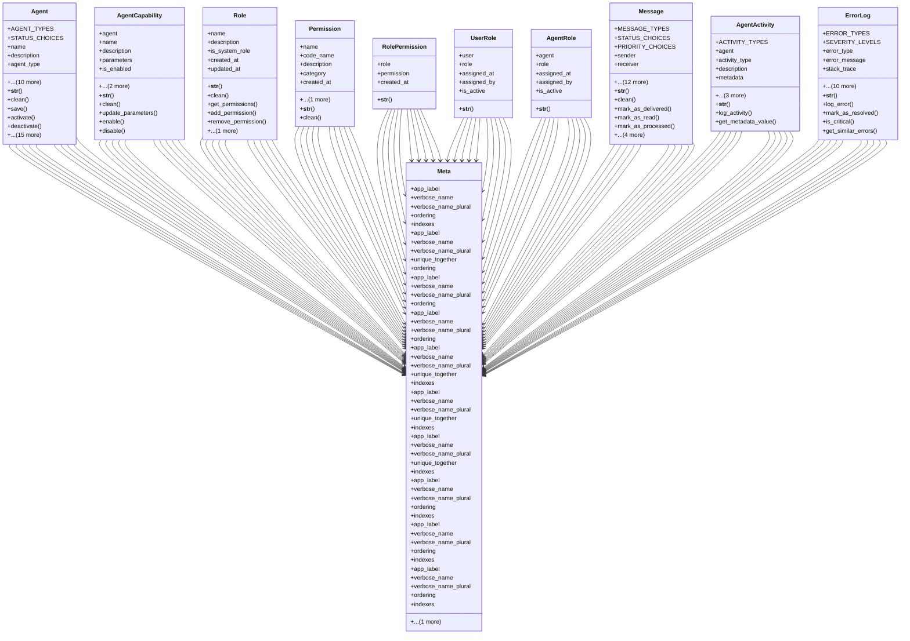

# integration_modules.ai_agents.models

## Imports
- django.conf
- django.core.exceptions
- django.core.validators
- django.db
- django.utils
- django.utils.translation
- json
- logging
- uuid

## Classes
- Agent
  - attr: `AGENT_TYPES`
  - attr: `STATUS_CHOICES`
  - attr: `name`
  - attr: `description`
  - attr: `agent_type`
  - attr: `owner`
  - attr: `avatar`
  - attr: `configuration`
  - attr: `status`
  - attr: `created_at`
  - attr: `updated_at`
  - attr: `last_active`
  - attr: `api_key`
  - attr: `version`
  - attr: `is_system_agent`
  - method: `__str__`
  - method: `clean`
  - method: `save`
  - method: `activate`
  - method: `deactivate`
  - method: `suspend`
  - method: `update_last_active`
  - method: `update_configuration`
  - method: `send_message`
  - method: `get_capabilities`
  - method: `has_capability`
  - method: `add_capability`
  - method: `remove_capability`
  - method: `get_roles`
  - method: `has_role`
  - method: `has_permission`
  - method: `regenerate_api_key`
  - method: `is_active`
  - method: `get_recent_activities`
  - method: `get_message_count`
- AgentCapability
  - attr: `agent`
  - attr: `name`
  - attr: `description`
  - attr: `parameters`
  - attr: `is_enabled`
  - attr: `created_at`
  - attr: `updated_at`
  - method: `__str__`
  - method: `clean`
  - method: `update_parameters`
  - method: `enable`
  - method: `disable`
- Role
  - attr: `name`
  - attr: `description`
  - attr: `is_system_role`
  - attr: `created_at`
  - attr: `updated_at`
  - method: `__str__`
  - method: `clean`
  - method: `get_permissions`
  - method: `add_permission`
  - method: `remove_permission`
  - method: `has_permission`
- Permission
  - attr: `name`
  - attr: `code_name`
  - attr: `description`
  - attr: `category`
  - attr: `created_at`
  - attr: `updated_at`
  - method: `__str__`
  - method: `clean`
- RolePermission
  - attr: `role`
  - attr: `permission`
  - attr: `created_at`
  - method: `__str__`
- UserRole
  - attr: `user`
  - attr: `role`
  - attr: `assigned_at`
  - attr: `assigned_by`
  - attr: `is_active`
  - method: `__str__`
- AgentRole
  - attr: `agent`
  - attr: `role`
  - attr: `assigned_at`
  - attr: `assigned_by`
  - attr: `is_active`
  - method: `__str__`
- Message
  - attr: `MESSAGE_TYPES`
  - attr: `STATUS_CHOICES`
  - attr: `PRIORITY_CHOICES`
  - attr: `sender`
  - attr: `receiver`
  - attr: `message_type`
  - attr: `content`
  - attr: `metadata`
  - attr: `status`
  - attr: `priority`
  - attr: `created_at`
  - attr: `delivered_at`
  - attr: `read_at`
  - attr: `processed_at`
  - attr: `error_message`
  - attr: `retry_count`
  - attr: `expires_at`
  - method: `__str__`
  - method: `clean`
  - method: `mark_as_delivered`
  - method: `mark_as_read`
  - method: `mark_as_processed`
  - method: `mark_as_failed`
  - method: `get_content_as_dict`
  - method: `is_expired`
  - method: `can_retry`
- AgentActivity
  - attr: `ACTIVITY_TYPES`
  - attr: `agent`
  - attr: `activity_type`
  - attr: `description`
  - attr: `metadata`
  - attr: `created_at`
  - attr: `ip_address`
  - attr: `user_agent`
  - method: `__str__`
  - method: `log_activity`
  - method: `get_metadata_value`
- ErrorLog
  - attr: `ERROR_TYPES`
  - attr: `SEVERITY_LEVELS`
  - attr: `error_type`
  - attr: `error_message`
  - attr: `stack_trace`
  - attr: `agent`
  - attr: `message`
  - attr: `severity`
  - attr: `metadata`
  - attr: `created_at`
  - attr: `resolved`
  - attr: `resolved_at`
  - attr: `resolved_by`
  - attr: `resolution_notes`
  - attr: `error_code`
  - method: `__str__`
  - method: `log_error`
  - method: `mark_as_resolved`
  - method: `is_critical`
  - method: `get_similar_errors`
- Meta
  - attr: `app_label`
  - attr: `verbose_name`
  - attr: `verbose_name_plural`
  - attr: `ordering`
  - attr: `indexes`
- Meta
  - attr: `app_label`
  - attr: `verbose_name`
  - attr: `verbose_name_plural`
  - attr: `unique_together`
  - attr: `ordering`
  - attr: `indexes`
- Meta
  - attr: `app_label`
  - attr: `verbose_name`
  - attr: `verbose_name_plural`
  - attr: `ordering`
- Meta
  - attr: `app_label`
  - attr: `verbose_name`
  - attr: `verbose_name_plural`
  - attr: `ordering`
- Meta
  - attr: `app_label`
  - attr: `verbose_name`
  - attr: `verbose_name_plural`
  - attr: `unique_together`
  - attr: `indexes`
- Meta
  - attr: `app_label`
  - attr: `verbose_name`
  - attr: `verbose_name_plural`
  - attr: `unique_together`
  - attr: `indexes`
- Meta
  - attr: `app_label`
  - attr: `verbose_name`
  - attr: `verbose_name_plural`
  - attr: `unique_together`
  - attr: `indexes`
- Meta
  - attr: `app_label`
  - attr: `verbose_name`
  - attr: `verbose_name_plural`
  - attr: `ordering`
  - attr: `indexes`
- Meta
  - attr: `app_label`
  - attr: `verbose_name`
  - attr: `verbose_name_plural`
  - attr: `ordering`
  - attr: `indexes`
- Meta
  - attr: `app_label`
  - attr: `verbose_name`
  - attr: `verbose_name_plural`
  - attr: `ordering`
  - attr: `indexes`

## Functions
- __str__
- clean
- save
- activate
- deactivate
- suspend
- update_last_active
- update_configuration
- send_message
- get_capabilities
- has_capability
- add_capability
- remove_capability
- get_roles
- has_role
- has_permission
- regenerate_api_key
- is_active
- get_recent_activities
- get_message_count
- __str__
- clean
- update_parameters
- enable
- disable
- __str__
- clean
- get_permissions
- add_permission
- remove_permission
- has_permission
- __str__
- clean
- __str__
- __str__
- __str__
- __str__
- clean
- mark_as_delivered
- mark_as_read
- mark_as_processed
- mark_as_failed
- get_content_as_dict
- is_expired
- can_retry
- __str__
- log_activity
- get_metadata_value
- __str__
- log_error
- mark_as_resolved
- is_critical
- get_similar_errors

## Module Variables
- `logger`

## Class Diagram

