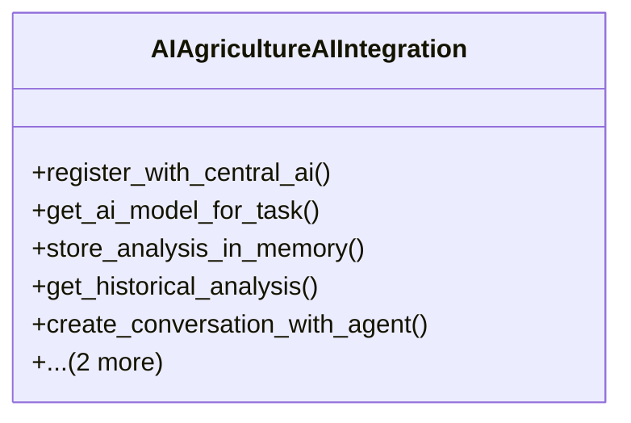

# integration_modules.ai_agriculture.ai_integration

## Imports
- ai.services.model_service
- ai.services.registry_service
- ai_a2a.api.conversation_api
- ai_a2a.api.coordinator_api
- ai_a2a.api.permission_api
- django.conf
- django.db
- django.utils
- logging
- memory.services.memory_service

## Classes
- AIAgricultureAIIntegration
  - method: `register_with_central_ai`
  - method: `get_ai_model_for_task`
  - method: `store_analysis_in_memory`
  - method: `get_historical_analysis`
  - method: `create_conversation_with_agent`
  - method: `check_user_permissions`
  - method: `notify_ai_coordinator`

## Functions
- register_with_central_ai
- get_ai_model_for_task
- store_analysis_in_memory
- get_historical_analysis
- create_conversation_with_agent
- check_user_permissions
- notify_ai_coordinator

## Module Variables
- `logger`

## Class Diagram

