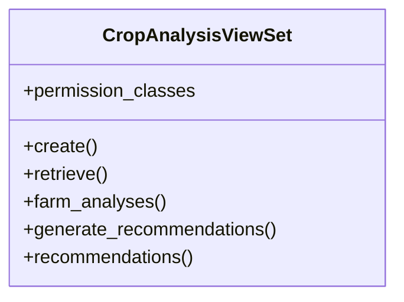

# integration_modules.ai_agriculture.api.crop_analysis_api

## Imports
- django.db
- django.shortcuts
- models
- rest_framework
- rest_framework.decorators
- rest_framework.response
- services.crop_analysis_service

## Classes
- CropAnalysisViewSet
  - attr: `permission_classes`
  - method: `create`
  - method: `retrieve`
  - method: `farm_analyses`
  - method: `generate_recommendations`
  - method: `recommendations`

## Functions
- create
- retrieve
- farm_analyses
- generate_recommendations
- recommendations

## Class Diagram

