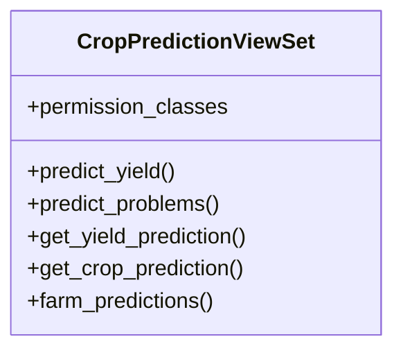

# integration_modules.ai_agriculture.api.crop_prediction_api

## Imports
- django.db
- django.shortcuts
- models
- rest_framework
- rest_framework.decorators
- rest_framework.response
- services.crop_prediction_service

## Classes
- CropPredictionViewSet
  - attr: `permission_classes`
  - method: `predict_yield`
  - method: `predict_problems`
  - method: `get_yield_prediction`
  - method: `get_crop_prediction`
  - method: `farm_predictions`

## Functions
- predict_yield
- predict_problems
- get_yield_prediction
- get_crop_prediction
- farm_predictions

## Class Diagram

