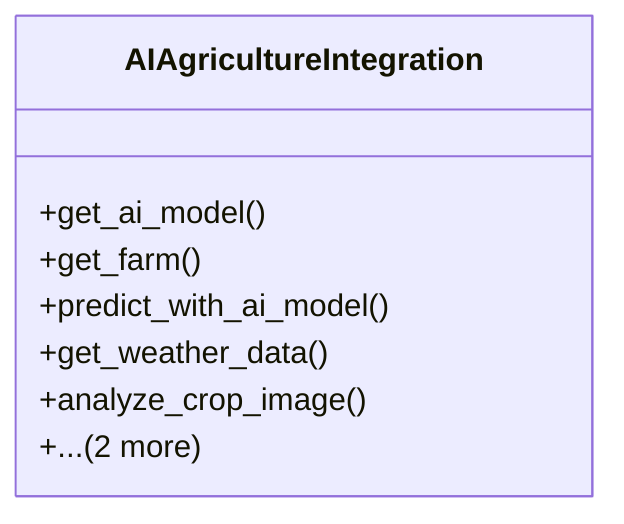

# integration_modules.ai_agriculture.integration

## Imports
- agricultural_modules.farms.models
- ai.models
- ai.services.image_analysis_service
- ai.services.model_service
- core.events.models
- django.db
- django.utils
- logging
- notifications.services
- weather_services.api

## Classes
- AIAgricultureIntegration
  - method: `get_ai_model`
  - method: `get_farm`
  - method: `predict_with_ai_model`
  - method: `get_weather_data`
  - method: `analyze_crop_image`
  - method: `register_crop_analysis_event`
  - method: `send_notification`

## Functions
- get_ai_model
- get_farm
- predict_with_ai_model
- get_weather_data
- analyze_crop_image
- register_crop_analysis_event
- send_notification

## Module Variables
- `logger`

## Class Diagram

