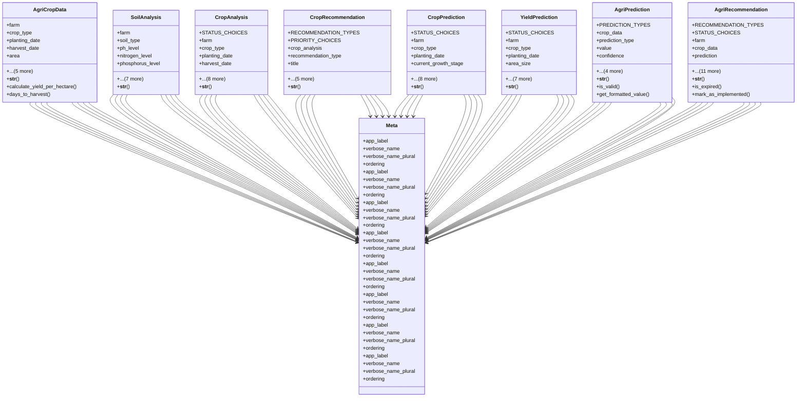

# integration_modules.ai_agriculture.models

## Imports
- django.conf
- django.core.validators
- django.db
- django.utils
- django.utils.translation

## Classes
- AgriCropData
  - attr: `farm`
  - attr: `crop_type`
  - attr: `planting_date`
  - attr: `harvest_date`
  - attr: `area`
  - attr: `yield_amount`
  - attr: `yield_quality`
  - attr: `notes`
  - attr: `created_at`
  - attr: `updated_at`
  - method: `__str__`
  - method: `calculate_yield_per_hectare`
  - method: `days_to_harvest`
- SoilAnalysis
  - attr: `farm`
  - attr: `soil_type`
  - attr: `ph_level`
  - attr: `nitrogen_level`
  - attr: `phosphorus_level`
  - attr: `potassium_level`
  - attr: `organic_matter`
  - attr: `moisture_content`
  - attr: `analysis_date`
  - attr: `notes`
  - attr: `created_at`
  - attr: `updated_at`
  - method: `__str__`
- CropAnalysis
  - attr: `STATUS_CHOICES`
  - attr: `farm`
  - attr: `crop_type`
  - attr: `planting_date`
  - attr: `harvest_date`
  - attr: `environmental_data`
  - attr: `soil_analysis`
  - attr: `analysis_date`
  - attr: `status`
  - attr: `analysis_result`
  - attr: `ai_model`
  - attr: `created_at`
  - attr: `updated_at`
  - method: `__str__`
- CropRecommendation
  - attr: `RECOMMENDATION_TYPES`
  - attr: `PRIORITY_CHOICES`
  - attr: `crop_analysis`
  - attr: `recommendation_type`
  - attr: `title`
  - attr: `description`
  - attr: `priority`
  - attr: `implementation_deadline`
  - attr: `created_at`
  - attr: `updated_at`
  - method: `__str__`
- CropPrediction
  - attr: `STATUS_CHOICES`
  - attr: `farm`
  - attr: `crop_type`
  - attr: `planting_date`
  - attr: `current_growth_stage`
  - attr: `symptoms`
  - attr: `images`
  - attr: `prediction_date`
  - attr: `status`
  - attr: `prediction_result`
  - attr: `ai_model`
  - attr: `created_at`
  - attr: `updated_at`
  - method: `__str__`
- YieldPrediction
  - attr: `STATUS_CHOICES`
  - attr: `farm`
  - attr: `crop_type`
  - attr: `planting_date`
  - attr: `area_size`
  - attr: `soil_type`
  - attr: `prediction_date`
  - attr: `status`
  - attr: `prediction_result`
  - attr: `ai_model`
  - attr: `created_at`
  - attr: `updated_at`
  - method: `__str__`
- AgriPrediction
  - attr: `PREDICTION_TYPES`
  - attr: `crop_data`
  - attr: `prediction_type`
  - attr: `value`
  - attr: `confidence`
  - attr: `model`
  - attr: `input_parameters`
  - attr: `created_at`
  - attr: `valid_until`
  - method: `__str__`
  - method: `is_valid`
  - method: `get_formatted_value`
- AgriRecommendation
  - attr: `RECOMMENDATION_TYPES`
  - attr: `STATUS_CHOICES`
  - attr: `farm`
  - attr: `crop_data`
  - attr: `prediction`
  - attr: `recommendation_type`
  - attr: `title`
  - attr: `description`
  - attr: `priority`
  - attr: `status`
  - attr: `implementation_date`
  - attr: `deadline`
  - attr: `created_at`
  - attr: `updated_at`
  - attr: `created_by`
  - attr: `updated_by`
  - method: `__str__`
  - method: `is_expired`
  - method: `mark_as_implemented`
- Meta
  - attr: `app_label`
  - attr: `verbose_name`
  - attr: `verbose_name_plural`
  - attr: `ordering`
- Meta
  - attr: `app_label`
  - attr: `verbose_name`
  - attr: `verbose_name_plural`
  - attr: `ordering`
- Meta
  - attr: `app_label`
  - attr: `verbose_name`
  - attr: `verbose_name_plural`
  - attr: `ordering`
- Meta
  - attr: `app_label`
  - attr: `verbose_name`
  - attr: `verbose_name_plural`
  - attr: `ordering`
- Meta
  - attr: `app_label`
  - attr: `verbose_name`
  - attr: `verbose_name_plural`
  - attr: `ordering`
- Meta
  - attr: `app_label`
  - attr: `verbose_name`
  - attr: `verbose_name_plural`
  - attr: `ordering`
- Meta
  - attr: `app_label`
  - attr: `verbose_name`
  - attr: `verbose_name_plural`
  - attr: `ordering`
- Meta
  - attr: `app_label`
  - attr: `verbose_name`
  - attr: `verbose_name_plural`
  - attr: `ordering`

## Functions
- __str__
- calculate_yield_per_hectare
- days_to_harvest
- __str__
- __str__
- __str__
- __str__
- __str__
- __str__
- is_valid
- get_formatted_value
- __str__
- is_expired
- mark_as_implemented

## Class Diagram

