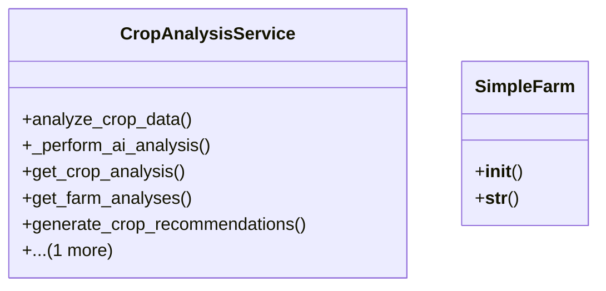

# integration_modules.ai_agriculture.services.crop_analysis_service

## Imports
- agricultural_modules.farms.models
- ai.models
- ai.services.model_service
- django.db
- django.utils
- logging
- models

## Classes
- CropAnalysisService
  - method: `analyze_crop_data`
  - method: `_perform_ai_analysis`
  - method: `get_crop_analysis`
  - method: `get_farm_analyses`
  - method: `generate_crop_recommendations`
  - method: `get_crop_recommendations`
- SimpleFarm
  - method: `__init__`
  - method: `__str__`

## Functions
- analyze_crop_data
- _perform_ai_analysis
- get_crop_analysis
- get_farm_analyses
- generate_crop_recommendations
- get_crop_recommendations
- __init__
- __str__

## Module Variables
- `logger`

## Class Diagram

