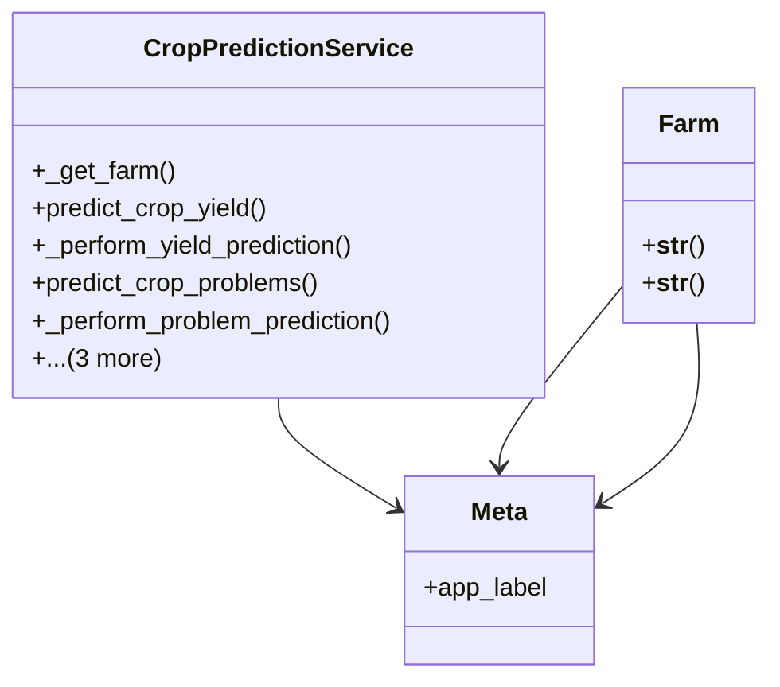

# integration_modules.ai_agriculture.services.crop_prediction_service

## Imports
- agricultural_modules.farms.models
- ai.models
- ai.services.model_service
- django.db
- django.utils
- logging
- models
- typing

## Classes
- CropPredictionService
  - method: `_get_farm`
  - method: `predict_crop_yield`
  - method: `_perform_yield_prediction`
  - method: `predict_crop_problems`
  - method: `_perform_problem_prediction`
  - method: `get_yield_prediction`
  - method: `get_crop_prediction`
  - method: `get_farm_predictions`
- Farm
  - method: `__str__`
- Farm
  - method: `__str__`
- Meta
  - attr: `app_label`

## Functions
- _get_farm
- predict_crop_yield
- _perform_yield_prediction
- predict_crop_problems
- _perform_problem_prediction
- get_yield_prediction
- get_crop_prediction
- get_farm_predictions
- __str__
- __str__

## Module Variables
- `logger`

## Class Diagram

