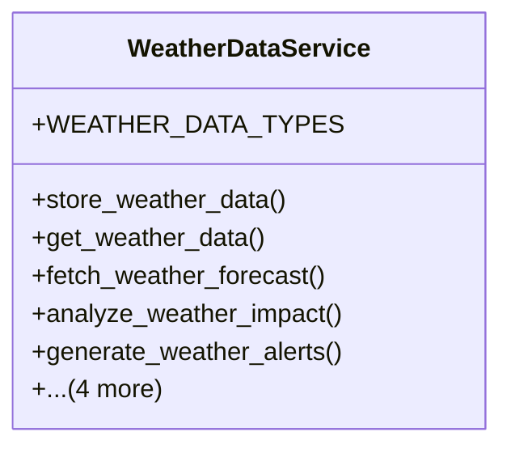

# integration_modules.ai_agriculture.services.weather_data_service

## Imports
- core_modules.activity_log.models
- datetime
- django.contrib.auth
- django.core.exceptions
- django.db
- django.utils
- json
- models
- numpy
- pandas
- requests

## Classes
- WeatherDataService
  - attr: `WEATHER_DATA_TYPES`
  - method: `store_weather_data`
  - method: `get_weather_data`
  - method: `fetch_weather_forecast`
  - method: `analyze_weather_impact`
  - method: `generate_weather_alerts`
  - method: `_fetch_weather_from_api`
  - method: `_analyze_weather_impact`
  - method: `_generate_weather_alerts`
  - method: `_log_activity`

## Functions
- store_weather_data
- get_weather_data
- fetch_weather_forecast
- analyze_weather_impact
- generate_weather_alerts
- _fetch_weather_from_api
- _analyze_weather_impact
- _generate_weather_alerts
- _log_activity

## Module Variables
- `User`

## Class Diagram

