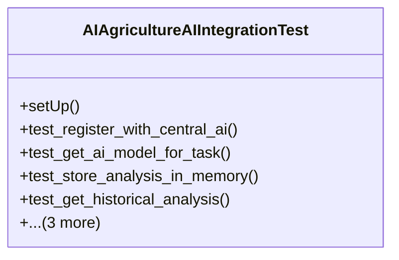

# integration_modules.ai_agriculture.tests.test_ai_integration

## Imports
- django.test
- django.utils
- integration_modules.ai_agriculture.ai_integration
- os
- sys
- unittest
- unittest.mock

## Classes
- AIAgricultureAIIntegrationTest
  - method: `setUp`
  - method: `test_register_with_central_ai`
  - method: `test_get_ai_model_for_task`
  - method: `test_store_analysis_in_memory`
  - method: `test_get_historical_analysis`
  - method: `test_create_conversation_with_agent`
  - method: `test_check_user_permissions`
  - method: `test_notify_ai_coordinator`

## Functions
- setUp
- test_register_with_central_ai
- test_get_ai_model_for_task
- test_store_analysis_in_memory
- test_get_historical_analysis
- test_create_conversation_with_agent
- test_check_user_permissions
- test_notify_ai_coordinator

## Class Diagram

