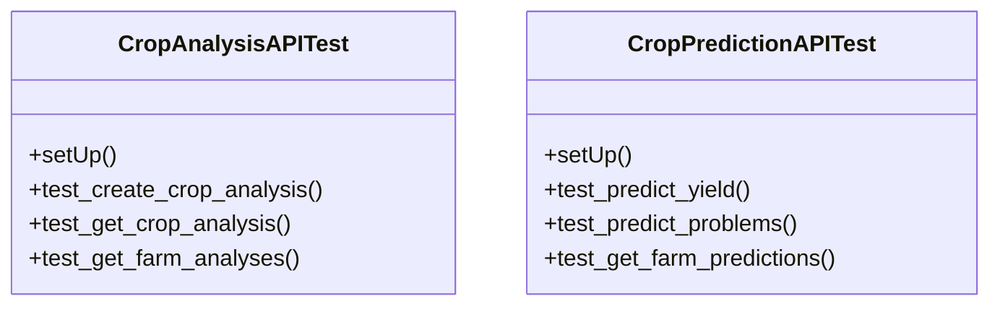

# integration_modules.ai_agriculture.tests.test_api

## Imports
- django.test
- django.utils
- integration_modules.ai_agriculture.models
- integration_modules.ai_agriculture.services.crop_analysis_service
- integration_modules.ai_agriculture.services.crop_prediction_service
- json
- os
- rest_framework
- rest_framework.test
- sys
- unittest
- unittest.mock

## Classes
- CropAnalysisAPITest
  - method: `setUp`
  - method: `test_create_crop_analysis`
  - method: `test_get_crop_analysis`
  - method: `test_get_farm_analyses`
- CropPredictionAPITest
  - method: `setUp`
  - method: `test_predict_yield`
  - method: `test_predict_problems`
  - method: `test_get_farm_predictions`

## Functions
- setUp
- test_create_crop_analysis
- test_get_crop_analysis
- test_get_farm_analyses
- setUp
- test_predict_yield
- test_predict_problems
- test_get_farm_predictions

## Class Diagram

