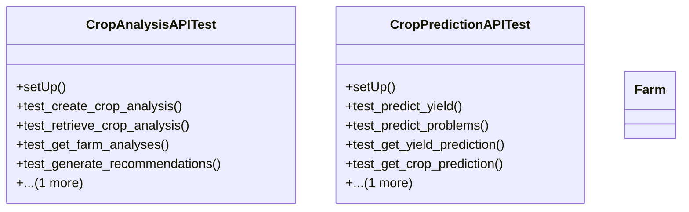

# integration_modules.ai_agriculture.tests.test_apis

## Imports
- django.contrib.auth.models
- django.db
- django.test
- django.urls
- django.utils
- models
- rest_framework
- rest_framework.test

## Classes
- CropAnalysisAPITest
  - method: `setUp`
  - method: `test_create_crop_analysis`
  - method: `test_retrieve_crop_analysis`
  - method: `test_get_farm_analyses`
  - method: `test_generate_recommendations`
  - method: `test_get_recommendations`
- CropPredictionAPITest
  - method: `setUp`
  - method: `test_predict_yield`
  - method: `test_predict_problems`
  - method: `test_get_yield_prediction`
  - method: `test_get_crop_prediction`
  - method: `test_farm_predictions`
- Farm
- Farm

## Functions
- setUp
- test_create_crop_analysis
- test_retrieve_crop_analysis
- test_get_farm_analyses
- test_generate_recommendations
- test_get_recommendations
- setUp
- test_predict_yield
- test_predict_problems
- test_get_yield_prediction
- test_get_crop_prediction
- test_farm_predictions

## Class Diagram

