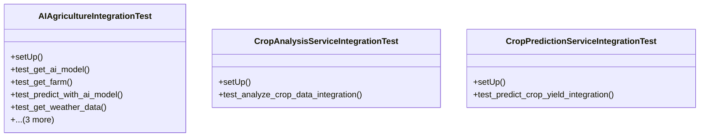

# integration_modules.ai_agriculture.tests.test_integration

## Imports
- django.test
- django.utils
- integration_modules.ai_agriculture.integration
- integration_modules.ai_agriculture.services.crop_analysis_service
- integration_modules.ai_agriculture.services.crop_prediction_service
- os
- sys
- unittest
- unittest.mock

## Classes
- AIAgricultureIntegrationTest
  - method: `setUp`
  - method: `test_get_ai_model`
  - method: `test_get_farm`
  - method: `test_predict_with_ai_model`
  - method: `test_get_weather_data`
  - method: `test_analyze_crop_image`
  - method: `test_register_crop_analysis_event`
  - method: `test_send_notification`
- CropAnalysisServiceIntegrationTest
  - method: `setUp`
  - method: `test_analyze_crop_data_integration`
- CropPredictionServiceIntegrationTest
  - method: `setUp`
  - method: `test_predict_crop_yield_integration`

## Functions
- setUp
- test_get_ai_model
- test_get_farm
- test_predict_with_ai_model
- test_get_weather_data
- test_analyze_crop_image
- test_register_crop_analysis_event
- test_send_notification
- setUp
- test_analyze_crop_data_integration
- setUp
- test_predict_crop_yield_integration

## Class Diagram

