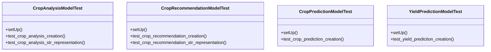

# integration_modules.ai_agriculture.tests.test_models

## Imports
- django.test
- django.utils
- integration_modules.ai_agriculture.models
- os
- sys
- unittest
- unittest.mock

## Classes
- CropAnalysisModelTest
  - method: `setUp`
  - method: `test_crop_analysis_creation`
  - method: `test_crop_analysis_str_representation`
- CropRecommendationModelTest
  - method: `setUp`
  - method: `test_crop_recommendation_creation`
  - method: `test_crop_recommendation_str_representation`
- CropPredictionModelTest
  - method: `setUp`
  - method: `test_crop_prediction_creation`
- YieldPredictionModelTest
  - method: `setUp`
  - method: `test_yield_prediction_creation`

## Functions
- setUp
- test_crop_analysis_creation
- test_crop_analysis_str_representation
- setUp
- test_crop_recommendation_creation
- test_crop_recommendation_str_representation
- setUp
- test_crop_prediction_creation
- setUp
- test_yield_prediction_creation

## Class Diagram

