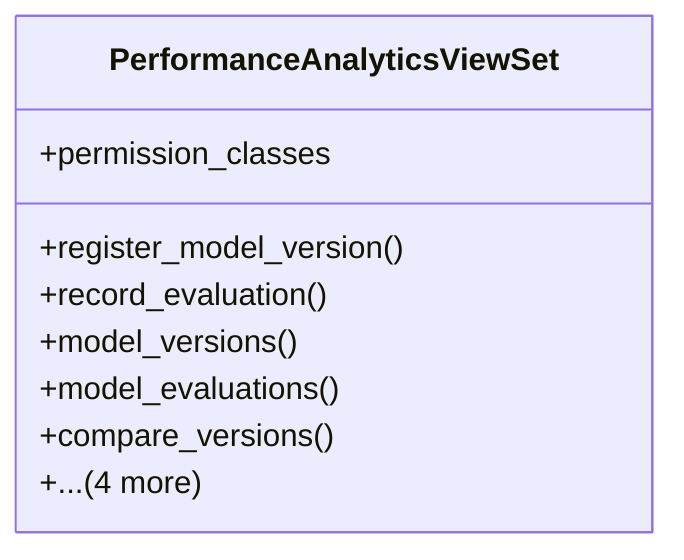

# integration_modules.ai_analytics.api.performance_analytics_api

## Imports
- rest_framework
- rest_framework.decorators
- rest_framework.response
- services.performance_analytics_service

## Classes
- PerformanceAnalyticsViewSet
  - attr: `permission_classes`
  - method: `register_model_version`
  - method: `record_evaluation`
  - method: `model_versions`
  - method: `model_evaluations`
  - method: `compare_versions`
  - method: `performance_trend`
  - method: `activate`
  - method: `deactivate`
  - method: `delete_version`

## Functions
- register_model_version
- record_evaluation
- model_versions
- model_evaluations
- compare_versions
- performance_trend
- activate
- deactivate
- delete_version

## Class Diagram

