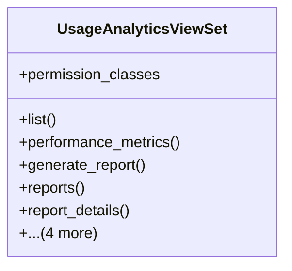

# integration_modules.ai_analytics.api.usage_analytics_api

## Imports
- datetime
- django.utils
- rest_framework
- rest_framework.decorators
- rest_framework.response
- services.usage_analytics_service

## Classes
- UsageAnalyticsViewSet
  - attr: `permission_classes`
  - method: `list`
  - method: `performance_metrics`
  - method: `generate_report`
  - method: `reports`
  - method: `report_details`
  - method: `delete_report`
  - method: `log_usage`
  - method: `record_metric`
  - method: `dashboard_summary`

## Functions
- list
- performance_metrics
- generate_report
- reports
- report_details
- delete_report
- log_usage
- record_metric
- dashboard_summary

## Class Diagram

