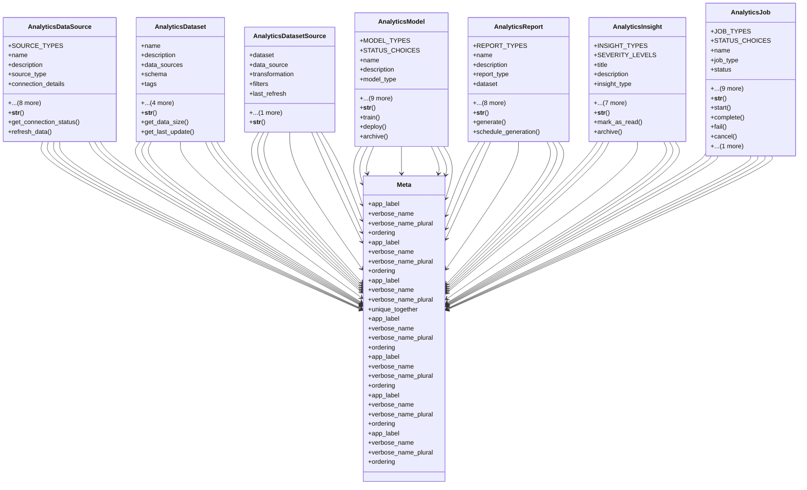

# integration_modules.ai_analytics.models

## Imports
- django.conf
- django.core.validators
- django.db
- django.utils
- django.utils.translation

## Classes
- AnalyticsDataSource
  - attr: `SOURCE_TYPES`
  - attr: `name`
  - attr: `description`
  - attr: `source_type`
  - attr: `connection_details`
  - attr: `credentials`
  - attr: `schema`
  - attr: `is_active`
  - attr: `refresh_interval`
  - attr: `last_refresh`
  - attr: `created_by`
  - attr: `created_at`
  - attr: `updated_at`
  - method: `__str__`
  - method: `get_connection_status`
  - method: `refresh_data`
- AnalyticsDataset
  - attr: `name`
  - attr: `description`
  - attr: `data_sources`
  - attr: `schema`
  - attr: `tags`
  - attr: `is_public`
  - attr: `created_by`
  - attr: `created_at`
  - attr: `updated_at`
  - method: `__str__`
  - method: `get_data_size`
  - method: `get_last_update`
- AnalyticsDatasetSource
  - attr: `dataset`
  - attr: `data_source`
  - attr: `transformation`
  - attr: `filters`
  - attr: `last_refresh`
  - attr: `created_at`
  - method: `__str__`
- AnalyticsModel
  - attr: `MODEL_TYPES`
  - attr: `STATUS_CHOICES`
  - attr: `name`
  - attr: `description`
  - attr: `model_type`
  - attr: `status`
  - attr: `version`
  - attr: `dataset`
  - attr: `parameters`
  - attr: `metrics`
  - attr: `model_path`
  - attr: `created_by`
  - attr: `created_at`
  - attr: `updated_at`
  - method: `__str__`
  - method: `train`
  - method: `deploy`
  - method: `archive`
- AnalyticsReport
  - attr: `REPORT_TYPES`
  - attr: `name`
  - attr: `description`
  - attr: `report_type`
  - attr: `dataset`
  - attr: `model`
  - attr: `config`
  - attr: `filters`
  - attr: `schedule`
  - attr: `is_public`
  - attr: `created_by`
  - attr: `created_at`
  - attr: `updated_at`
  - method: `__str__`
  - method: `generate`
  - method: `schedule_generation`
- AnalyticsInsight
  - attr: `INSIGHT_TYPES`
  - attr: `SEVERITY_LEVELS`
  - attr: `title`
  - attr: `description`
  - attr: `insight_type`
  - attr: `severity`
  - attr: `report`
  - attr: `model`
  - attr: `data`
  - attr: `is_read`
  - attr: `is_archived`
  - attr: `created_at`
  - method: `__str__`
  - method: `mark_as_read`
  - method: `archive`
- AnalyticsJob
  - attr: `JOB_TYPES`
  - attr: `STATUS_CHOICES`
  - attr: `name`
  - attr: `job_type`
  - attr: `status`
  - attr: `parameters`
  - attr: `result`
  - attr: `error_message`
  - attr: `progress`
  - attr: `scheduled_at`
  - attr: `started_at`
  - attr: `completed_at`
  - attr: `created_by`
  - attr: `created_at`
  - method: `__str__`
  - method: `start`
  - method: `complete`
  - method: `fail`
  - method: `cancel`
  - method: `update_progress`
- Meta
  - attr: `app_label`
  - attr: `verbose_name`
  - attr: `verbose_name_plural`
  - attr: `ordering`
- Meta
  - attr: `app_label`
  - attr: `verbose_name`
  - attr: `verbose_name_plural`
  - attr: `ordering`
- Meta
  - attr: `app_label`
  - attr: `verbose_name`
  - attr: `verbose_name_plural`
  - attr: `unique_together`
- Meta
  - attr: `app_label`
  - attr: `verbose_name`
  - attr: `verbose_name_plural`
  - attr: `ordering`
- Meta
  - attr: `app_label`
  - attr: `verbose_name`
  - attr: `verbose_name_plural`
  - attr: `ordering`
- Meta
  - attr: `app_label`
  - attr: `verbose_name`
  - attr: `verbose_name_plural`
  - attr: `ordering`
- Meta
  - attr: `app_label`
  - attr: `verbose_name`
  - attr: `verbose_name_plural`
  - attr: `ordering`

## Functions
- __str__
- get_connection_status
- refresh_data
- __str__
- get_data_size
- get_last_update
- __str__
- __str__
- train
- deploy
- archive
- __str__
- generate
- schedule_generation
- __str__
- mark_as_read
- archive
- __str__
- start
- complete
- fail
- cancel
- update_progress

## Class Diagram

