# integration_modules.ai_analytics.services.performance_analytics_service

## Imports
- datetime
- django.db
- django.db.models
- django.utils
- logging
- models
- typing

## Classes
- _DummyContext
  - method: `__enter__`
  - method: `__exit__`
- PerformanceAnalyticsService
  - method: `register_model_version`
  - method: `record_model_evaluation`
  - method: `get_model_versions`
  - method: `get_model_evaluations`
  - method: `compare_model_versions`
  - method: `get_model_performance_trend`
  - method: `activate_model_version`
  - method: `deactivate_model_version`
  - method: `delete_model_version`
- timezone
  - method: `now`
- transaction
  - method: `atomic`
- Count
  - method: `__init__`
- Sum
  - method: `__init__`
- Avg
  - method: `__init__`
- F
  - method: `__init__`
- Q
  - method: `__init__`
  - method: `__and__`
  - method: `__or__`
- Case
  - method: `__init__`
- When
  - method: `__init__`
- IntegerField
- AIModelVersion
  - attr: `objects`
  - method: `save`
  - method: `delete`
- objects
  - method: `create`
  - method: `get`
  - method: `filter`
  - method: `all`
  - method: `exclude`
  - method: `update`
  - method: `order_by`
  - method: `first`
  - method: `__iter__`
  - method: `__getitem__`
- DoesNotExist

## Functions
- is_performance_analytics_available
- get_performance_analytics_service
- __enter__
- __exit__
- register_model_version
- record_model_evaluation
- get_model_versions
- get_model_evaluations
- compare_model_versions
- get_model_performance_trend
- activate_model_version
- deactivate_model_version
- delete_model_version
- now
- atomic
- __init__
- __init__
- __init__
- __init__
- __init__
- __and__
- __or__
- __init__
- __init__
- save
- delete
- create
- get
- filter
- all
- exclude
- update
- order_by
- first
- __iter__
- __getitem__

## Module Variables
- `logger`
- `__all__`

## Class Diagram

```mermaid
classDiagram
    class _DummyContext {
        +__enter__()
        +__exit__()
    }
    class PerformanceAnalyticsService {
        +register_model_version()
        +record_model_evaluation()
        +get_model_versions()
        +get_model_evaluations()
        +compare_model_versions()
        +... (4 more)
    }
    class timezone {
        +now()
    }
    class transaction {
        +atomic()
    }
    class Count {
        +__init__()
    }
    class Sum {
        +__init__()
    }
    class Avg {
        +__init__()
    }
    class F {
        +__init__()
    }
    class Q {
        +__init__()
        +__and__()
        +__or__()
    }
    class Case {
        +__init__()
    }
    class When {
        +__init__()
    }
    class IntegerField {
    }
    class AIModelVersion {
        +objects
        +save()
        +delete()
    }
    class objects {
        +create()
        +get()
        +filter()
        +all()
        +exclude()
        +... (5 more)
    }
    class DoesNotExist {
    }
```

