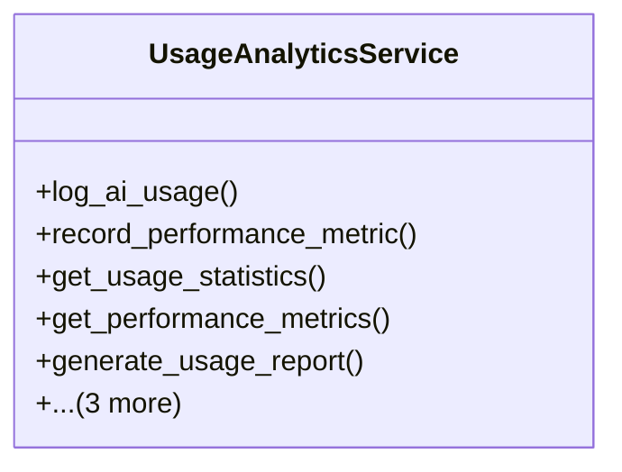

# integration_modules.ai_analytics.services.usage_analytics_service

## Imports
- django.contrib.auth
- django.db
- django.db.models
- django.utils
- models

## Classes
- UsageAnalyticsService
  - method: `log_ai_usage`
  - method: `record_performance_metric`
  - method: `get_usage_statistics`
  - method: `get_performance_metrics`
  - method: `generate_usage_report`
  - method: `get_usage_report`
  - method: `get_recent_reports`
  - method: `delete_usage_report`

## Functions
- log_ai_usage
- record_performance_metric
- get_usage_statistics
- get_performance_metrics
- generate_usage_report
- get_usage_report
- get_recent_reports
- delete_usage_report

## Class Diagram

