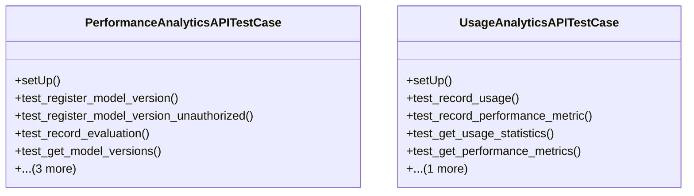

# integration_modules.ai_analytics.tests.test_api

## Imports
- django
- django.conf
- django.contrib.auth
- django.test
- django.urls
- integration_modules.ai_analytics.models
- json
- os
- rest_framework
- rest_framework.test
- sys
- unittest

## Classes
- PerformanceAnalyticsAPITestCase
  - method: `setUp`
  - method: `test_register_model_version`
  - method: `test_register_model_version_unauthorized`
  - method: `test_record_evaluation`
  - method: `test_get_model_versions`
  - method: `test_compare_versions`
  - method: `test_activate_deactivate_version`
  - method: `test_delete_version`
- UsageAnalyticsAPITestCase
  - method: `setUp`
  - method: `test_record_usage`
  - method: `test_record_performance_metric`
  - method: `test_get_usage_statistics`
  - method: `test_get_performance_metrics`
  - method: `test_create_usage_report`

## Functions
- setUp
- test_register_model_version
- test_register_model_version_unauthorized
- test_record_evaluation
- test_get_model_versions
- test_compare_versions
- test_activate_deactivate_version
- test_delete_version
- setUp
- test_record_usage
- test_record_performance_metric
- test_get_usage_statistics
- test_get_performance_metrics
- test_create_usage_report

## Module Variables
- `User`

## Class Diagram

