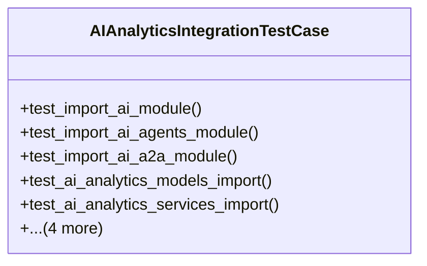

# integration_modules.ai_analytics.tests.test_integration

## Imports
- django
- django.conf
- django.test
- importlib
- integration_modules.ai.models
- integration_modules.ai_a2a.models
- integration_modules.ai_agents.models
- integration_modules.ai_analytics.api.performance_analytics_api
- integration_modules.ai_analytics.api.usage_analytics_api
- integration_modules.ai_analytics.models
- integration_modules.ai_analytics.services.performance_analytics_service
- integration_modules.ai_analytics.services.usage_analytics_service
- os
- sys
- unittest

## Classes
- AIAnalyticsIntegrationTestCase
  - method: `test_import_ai_module`
  - method: `test_import_ai_agents_module`
  - method: `test_import_ai_a2a_module`
  - method: `test_ai_analytics_models_import`
  - method: `test_ai_analytics_services_import`
  - method: `test_ai_analytics_api_import`
  - method: `test_integration_with_ai_module`
  - method: `test_integration_with_ai_agents_module`
  - method: `test_integration_with_ai_a2a_module`

## Functions
- test_import_ai_module
- test_import_ai_agents_module
- test_import_ai_a2a_module
- test_ai_analytics_models_import
- test_ai_analytics_services_import
- test_ai_analytics_api_import
- test_integration_with_ai_module
- test_integration_with_ai_agents_module
- test_integration_with_ai_a2a_module

## Class Diagram

