# integration_modules.ai_analytics.tests.test_models

## Imports
- django
- django.conf
- django.contrib.auth
- django.test
- django.utils
- integration_modules.ai_analytics.models
- os
- sys
- unittest

## Classes
- AnalyticsDataSourceTestCase
  - method: `setUp`
  - method: `test_data_source_creation`
  - method: `test_data_source_str_representation`
  - method: `test_get_connection_status`
  - method: `test_refresh_data`
- AnalyticsDatasetTestCase
  - method: `setUp`
  - method: `test_dataset_creation`
  - method: `test_dataset_str_representation`
  - method: `test_dataset_data_sources_relationship`
  - method: `test_dataset_source_relationship`
- AnalyticsModelTestCase
  - method: `setUp`
  - method: `test_model_creation`
  - method: `test_model_str_representation`
  - method: `test_model_train`
  - method: `test_model_deploy`
  - method: `test_model_archive`
- AnalyticsReportTestCase
  - method: `setUp`
  - method: `test_report_creation`
  - method: `test_report_str_representation`
  - method: `test_report_generate`
  - method: `test_report_schedule_generation`
- AnalyticsInsightTestCase
  - method: `setUp`
  - method: `test_insight_creation`
  - method: `test_insight_str_representation`
  - method: `test_insight_mark_as_read`
  - method: `test_insight_archive`
- AnalyticsJobTestCase
  - method: `setUp`
  - method: `test_job_creation`
  - method: `test_job_str_representation`
  - method: `test_job_start`
  - method: `test_job_complete`
  - method: `test_job_fail`
  - method: `test_job_cancel`

## Functions
- setUp
- test_data_source_creation
- test_data_source_str_representation
- test_get_connection_status
- test_refresh_data
- setUp
- test_dataset_creation
- test_dataset_str_representation
- test_dataset_data_sources_relationship
- test_dataset_source_relationship
- setUp
- test_model_creation
- test_model_str_representation
- test_model_train
- test_model_deploy
- test_model_archive
- setUp
- test_report_creation
- test_report_str_representation
- test_report_generate
- test_report_schedule_generation
- setUp
- test_insight_creation
- test_insight_str_representation
- test_insight_mark_as_read
- test_insight_archive
- setUp
- test_job_creation
- test_job_str_representation
- test_job_start
- test_job_complete
- test_job_fail
- test_job_cancel

## Module Variables
- `User`

## Class Diagram

```mermaid
classDiagram
    class AnalyticsDataSourceTestCase {
        +setUp()
        +test_data_source_creation()
        +test_data_source_str_representation()
        +test_get_connection_status()
        +test_refresh_data()
    }
    class AnalyticsDatasetTestCase {
        +setUp()
        +test_dataset_creation()
        +test_dataset_str_representation()
        +test_dataset_data_sources_relationship()
        +test_dataset_source_relationship()
    }
    class AnalyticsModelTestCase {
        +setUp()
        +test_model_creation()
        +test_model_str_representation()
        +test_model_train()
        +test_model_deploy()
        +... (1 more)
    }
    class AnalyticsReportTestCase {
        +setUp()
        +test_report_creation()
        +test_report_str_representation()
        +test_report_generate()
        +test_report_schedule_generation()
    }
    class AnalyticsInsightTestCase {
        +setUp()
        +test_insight_creation()
        +test_insight_str_representation()
        +test_insight_mark_as_read()
        +test_insight_archive()
    }
    class AnalyticsJobTestCase {
        +setUp()
        +test_job_creation()
        +test_job_str_representation()
        +test_job_start()
        +test_job_complete()
        +... (2 more)
    }
```

