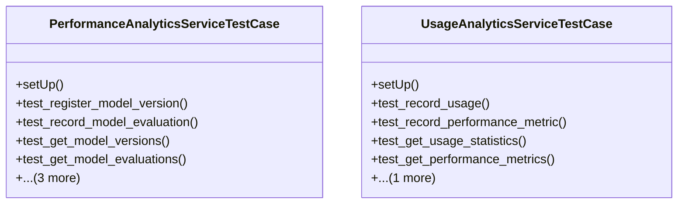

# integration_modules.ai_analytics.tests.test_services

## Imports
- datetime
- django
- django.conf
- django.contrib.auth
- django.test
- django.utils
- integration_modules.ai_analytics.models
- integration_modules.ai_analytics.services.performance_analytics_service
- integration_modules.ai_analytics.services.usage_analytics_service
- os
- sys
- unittest

## Classes
- PerformanceAnalyticsServiceTestCase
  - method: `setUp`
  - method: `test_register_model_version`
  - method: `test_record_model_evaluation`
  - method: `test_get_model_versions`
  - method: `test_get_model_evaluations`
  - method: `test_compare_model_versions`
  - method: `test_activate_deactivate_model_version`
  - method: `test_delete_model_version`
- UsageAnalyticsServiceTestCase
  - method: `setUp`
  - method: `test_record_usage`
  - method: `test_record_performance_metric`
  - method: `test_get_usage_statistics`
  - method: `test_get_performance_metrics`
  - method: `test_create_usage_report`

## Functions
- setUp
- test_register_model_version
- test_record_model_evaluation
- test_get_model_versions
- test_get_model_evaluations
- test_compare_model_versions
- test_activate_deactivate_model_version
- test_delete_model_version
- setUp
- test_record_usage
- test_record_performance_metric
- test_get_usage_statistics
- test_get_performance_metrics
- test_create_usage_report

## Module Variables
- `User`

## Class Diagram

