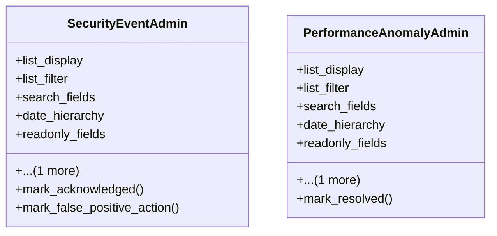

# integration_modules.ai_monitoring.admin

## Imports
- django.contrib
- django.db
- models

## Classes
- SecurityEventAdmin
  - attr: `list_display`
  - attr: `list_filter`
  - attr: `search_fields`
  - attr: `date_hierarchy`
  - attr: `readonly_fields`
  - attr: `actions`
  - method: `mark_acknowledged`
  - method: `mark_false_positive_action`
- PerformanceAnomalyAdmin
  - attr: `list_display`
  - attr: `list_filter`
  - attr: `search_fields`
  - attr: `date_hierarchy`
  - attr: `readonly_fields`
  - attr: `actions`
  - method: `mark_resolved`

## Functions
- mark_acknowledged
- mark_false_positive_action
- mark_resolved

## Class Diagram

