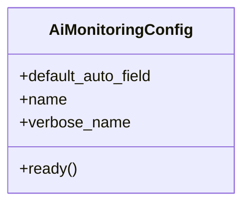

# integration_modules.ai_monitoring.apps

## Imports
- django.apps
- integration_modules.ai_monitoring.signals

## Classes
- AiMonitoringConfig
  - attr: `default_auto_field`
  - attr: `name`
  - attr: `verbose_name`
  - method: `ready`

## Functions
- ready

## Class Diagram

