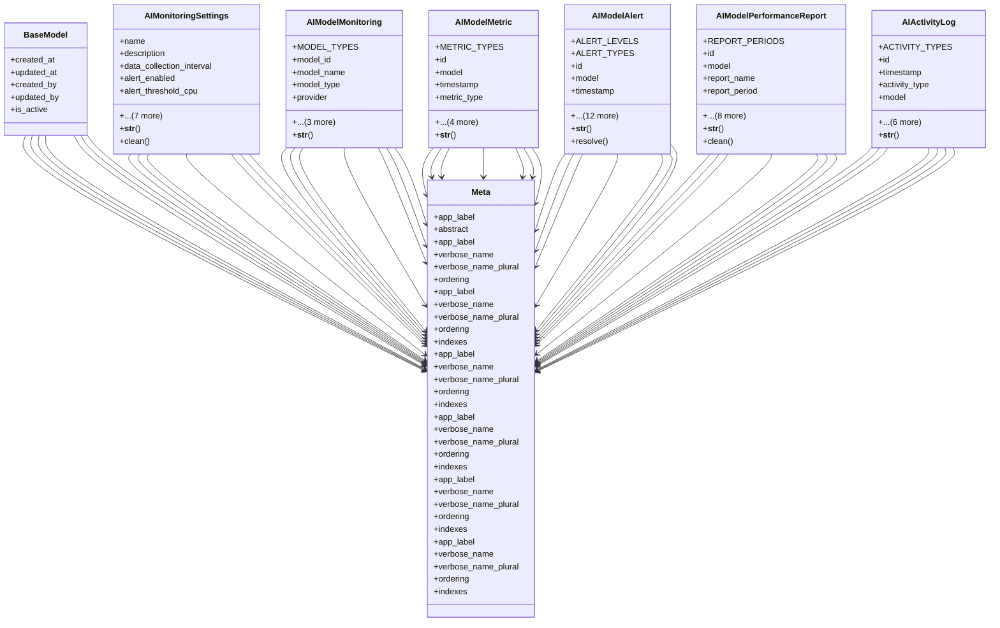

# integration_modules.ai_monitoring.models

## Imports
- django.conf
- django.core.exceptions
- django.db
- django.utils
- django.utils.translation
- uuid

## Classes
- BaseModel
  - attr: `created_at`
  - attr: `updated_at`
  - attr: `created_by`
  - attr: `updated_by`
  - attr: `is_active`
- AIMonitoringSettings
  - attr: `name`
  - attr: `description`
  - attr: `data_collection_interval`
  - attr: `alert_enabled`
  - attr: `alert_threshold_cpu`
  - attr: `alert_threshold_memory`
  - attr: `alert_threshold_disk`
  - attr: `alert_threshold_error_rate`
  - attr: `alert_threshold_latency`
  - attr: `notification_email`
  - attr: `notification_webhook_url`
  - attr: `config`
  - method: `__str__`
  - method: `clean`
- AIModelMonitoring
  - attr: `MODEL_TYPES`
  - attr: `model_id`
  - attr: `model_name`
  - attr: `model_type`
  - attr: `provider`
  - attr: `version`
  - attr: `settings`
  - attr: `ai_service`
  - method: `__str__`
- AIModelMetric
  - attr: `METRIC_TYPES`
  - attr: `id`
  - attr: `model`
  - attr: `timestamp`
  - attr: `metric_type`
  - attr: `metric_name`
  - attr: `metric_value`
  - attr: `unit`
  - attr: `dimensions`
  - method: `__str__`
- AIModelAlert
  - attr: `ALERT_LEVELS`
  - attr: `ALERT_TYPES`
  - attr: `id`
  - attr: `model`
  - attr: `timestamp`
  - attr: `alert_level`
  - attr: `alert_type`
  - attr: `title`
  - attr: `description`
  - attr: `metric`
  - attr: `threshold_value`
  - attr: `actual_value`
  - attr: `is_resolved`
  - attr: `resolved_at`
  - attr: `resolved_by`
  - attr: `resolution_notes`
  - attr: `notification_sent`
  - method: `__str__`
  - method: `resolve`
- AIModelPerformanceReport
  - attr: `REPORT_PERIODS`
  - attr: `id`
  - attr: `model`
  - attr: `report_name`
  - attr: `report_period`
  - attr: `start_date`
  - attr: `end_date`
  - attr: `generated_at`
  - attr: `summary`
  - attr: `metrics_summary`
  - attr: `alerts_summary`
  - attr: `report_data`
  - attr: `report_file`
  - method: `__str__`
  - method: `clean`
- AIActivityLog
  - attr: `ACTIVITY_TYPES`
  - attr: `id`
  - attr: `timestamp`
  - attr: `activity_type`
  - attr: `model`
  - attr: `user`
  - attr: `agent_id`
  - attr: `description`
  - attr: `details`
  - attr: `related_alert`
  - attr: `related_report`
  - method: `__str__`
- Meta
  - attr: `app_label`
  - attr: `abstract`
- Meta
  - attr: `app_label`
  - attr: `verbose_name`
  - attr: `verbose_name_plural`
  - attr: `ordering`
- Meta
  - attr: `app_label`
  - attr: `verbose_name`
  - attr: `verbose_name_plural`
  - attr: `ordering`
  - attr: `indexes`
- Meta
  - attr: `app_label`
  - attr: `verbose_name`
  - attr: `verbose_name_plural`
  - attr: `ordering`
  - attr: `indexes`
- Meta
  - attr: `app_label`
  - attr: `verbose_name`
  - attr: `verbose_name_plural`
  - attr: `ordering`
  - attr: `indexes`
- Meta
  - attr: `app_label`
  - attr: `verbose_name`
  - attr: `verbose_name_plural`
  - attr: `ordering`
  - attr: `indexes`
- Meta
  - attr: `app_label`
  - attr: `verbose_name`
  - attr: `verbose_name_plural`
  - attr: `ordering`
  - attr: `indexes`

## Functions
- __str__
- clean
- __str__
- __str__
- __str__
- resolve
- __str__
- clean
- __str__

## Class Diagram

