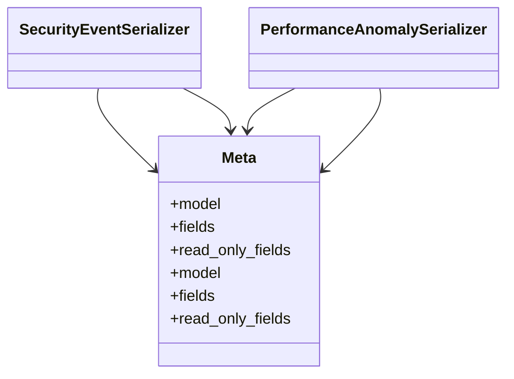

# integration_modules.ai_monitoring.serializers

## Imports
- models
- rest_framework

## Classes
- SecurityEventSerializer
- PerformanceAnomalySerializer
- Meta
  - attr: `model`
  - attr: `fields`
  - attr: `read_only_fields`
- Meta
  - attr: `model`
  - attr: `fields`
  - attr: `read_only_fields`

## Class Diagram

