# integration_modules.ai_security.models

## Imports
- ai.models
- ai_agents.models
- datetime
- django.conf
- django.core.validators
- django.db
- django.utils
- django.utils.translation

## Classes
- SecurityPolicy
  - attr: `POLICY_TYPES`
  - attr: `name`
  - attr: `policy_type`
  - attr: `description`
  - attr: `rules`
  - attr: `is_active`
  - attr: `applies_to_models`
  - attr: `applies_to_agents`
  - attr: `created_by`
  - attr: `created_at`
  - attr: `updated_at`
  - method: `__str__`
  - method: `validate_against_model`
  - method: `validate_against_agent`
- SecurityAudit
  - attr: `AUDIT_TYPES`
  - attr: `STATUS_CHOICES`
  - attr: `name`
  - attr: `audit_type`
  - attr: `description`
  - attr: `status`
  - attr: `scope`
  - attr: `findings`
  - attr: `recommendations`
  - attr: `scheduled_at`
  - attr: `started_at`
  - attr: `completed_at`
  - attr: `conducted_by`
  - attr: `created_at`
  - method: `__str__`
  - method: `start`
  - method: `complete`
  - method: `fail`
  - method: `cancel`
- SecurityIncident
  - attr: `INCIDENT_TYPES`
  - attr: `SEVERITY_LEVELS`
  - attr: `STATUS_CHOICES`
  - attr: `title`
  - attr: `incident_type`
  - attr: `description`
  - attr: `severity`
  - attr: `status`
  - attr: `affected_systems`
  - attr: `reported_by`
  - attr: `assigned_to`
  - attr: `reported_at`
  - attr: `resolved_at`
  - attr: `resolution`
  - attr: `root_cause`
  - attr: `lessons_learned`
  - method: `__str__`
  - method: `assign`
  - method: `start_investigation`
  - method: `mark_as_contained`
  - method: `resolve`
  - method: `close`
- SecurityVulnerability
  - attr: `VULNERABILITY_TYPES`
  - attr: `SEVERITY_LEVELS`
  - attr: `STATUS_CHOICES`
  - attr: `title`
  - attr: `vulnerability_type`
  - attr: `description`
  - attr: `severity`
  - attr: `status`
  - attr: `affected_models`
  - attr: `affected_agents`
  - attr: `discovered_by`
  - attr: `assigned_to`
  - attr: `discovered_at`
  - attr: `remediated_at`
  - attr: `remediation_steps`
  - attr: `verification_steps`
  - method: `__str__`
  - method: `confirm`
  - method: `start_remediation`
  - method: `remediate`
  - method: `mark_as_false_positive`
  - method: `accept_risk`
- SecurityScan
  - attr: `SCAN_TYPES`
  - attr: `STATUS_CHOICES`
  - attr: `name`
  - attr: `scan_type`
  - attr: `description`
  - attr: `status`
  - attr: `configuration`
  - attr: `target_models`
  - attr: `target_agents`
  - attr: `results`
  - attr: `scheduled_at`
  - attr: `started_at`
  - attr: `completed_at`
  - attr: `created_by`
  - attr: `created_at`
  - method: `__str__`
  - method: `start`
  - method: `complete`
  - method: `fail`
  - method: `cancel`
  - method: `create_vulnerabilities_from_results`
- SecurityAccessControl
  - attr: `RESOURCE_TYPES`
  - attr: `ACCESS_LEVELS`
  - attr: `name`
  - attr: `description`
  - attr: `resource_type`
  - attr: `resource_id`
  - attr: `access_level`
  - attr: `roles`
  - attr: `users`
  - attr: `conditions`
  - attr: `is_active`
  - attr: `created_by`
  - attr: `created_at`
  - attr: `updated_at`
  - method: `__str__`
  - method: `check_access`
  - method: `_check_conditions`
- Meta
  - attr: `app_label`
  - attr: `verbose_name`
  - attr: `verbose_name_plural`
  - attr: `ordering`
- Meta
  - attr: `app_label`
  - attr: `verbose_name`
  - attr: `verbose_name_plural`
  - attr: `ordering`
- Meta
  - attr: `app_label`
  - attr: `verbose_name`
  - attr: `verbose_name_plural`
  - attr: `ordering`
- Meta
  - attr: `app_label`
  - attr: `verbose_name`
  - attr: `verbose_name_plural`
  - attr: `ordering`
- Meta
  - attr: `app_label`
  - attr: `verbose_name`
  - attr: `verbose_name_plural`
  - attr: `ordering`
- Meta
  - attr: `app_label`
  - attr: `verbose_name`
  - attr: `verbose_name_plural`
  - attr: `ordering`
- models
  - attr: `SET_NULL`
- settings
  - attr: `AUTH_USER_MODEL`
- MinValueValidator
  - method: `__init__`
- MaxValueValidator
  - method: `__init__`
- Model
  - method: `__init__`
  - method: `save`
  - method: `delete`
- CharField
  - method: `__init__`
- TextField
  - method: `__init__`
- BooleanField
  - method: `__init__`
- DateTimeField
  - method: `__init__`
- ForeignKey
  - method: `__init__`
- ManyToManyField
  - method: `__init__`
- JSONField
  - method: `__init__`
- timezone
  - method: `now`
- timezone
  - method: `now`
- timezone
  - method: `now`
- timezone
  - method: `now`
- timezone
  - method: `now`
- timezone
  - method: `now`
- timezone
  - method: `now`
- timezone
  - method: `now`

## Functions
- is_security_models_available
- __str__
- validate_against_model
- validate_against_agent
- __str__
- start
- complete
- fail
- cancel
- __str__
- assign
- start_investigation
- mark_as_contained
- resolve
- close
- __str__
- confirm
- start_remediation
- remediate
- mark_as_false_positive
- accept_risk
- __str__
- start
- complete
- fail
- cancel
- create_vulnerabilities_from_results
- __str__
- check_access
- _check_conditions
- _
- __init__
- __init__
- __init__
- save
- delete
- __init__
- __init__
- __init__
- __init__
- __init__
- __init__
- __init__
- now
- now
- now
- now
- now
- now
- now
- now

## Module Variables
- `__all__`

## Class Diagram

```mermaid
classDiagram
    class SecurityPolicy {
        +POLICY_TYPES
        +name
        +policy_type
        +description
        +rules
        +... (6 more)
        +__str__()
        +validate_against_model()
        +validate_against_agent()
    }
    class SecurityAudit {
        +AUDIT_TYPES
        +STATUS_CHOICES
        +name
        +audit_type
        +description
        +... (9 more)
        +__str__()
        +start()
        +complete()
        +fail()
        +cancel()
    }
    class SecurityIncident {
        +INCIDENT_TYPES
        +SEVERITY_LEVELS
        +STATUS_CHOICES
        +title
        +incident_type
        +... (11 more)
        +__str__()
        +assign()
        +start_investigation()
        +mark_as_contained()
        +resolve()
        +... (1 more)
    }
    class SecurityVulnerability {
        +VULNERABILITY_TYPES
        +SEVERITY_LEVELS
        +STATUS_CHOICES
        +title
        +vulnerability_type
        +... (11 more)
        +__str__()
        +confirm()
        +start_remediation()
        +remediate()
        +mark_as_false_positive()
        +... (1 more)
    }
    class SecurityScan {
        +SCAN_TYPES
        +STATUS_CHOICES
        +name
        +scan_type
        +description
        +... (10 more)
        +__str__()
        +start()
        +complete()
        +fail()
        +cancel()
        +... (1 more)
    }
    class SecurityAccessControl {
        +RESOURCE_TYPES
        +ACCESS_LEVELS
        +name
        +description
        +resource_type
        +... (9 more)
        +__str__()
        +check_access()
        +_check_conditions()
    }
    class Meta {
        +app_label
        +verbose_name
        +verbose_name_plural
        +ordering
    }
    class Meta {
        +app_label
        +verbose_name
        +verbose_name_plural
        +ordering
    }
    class Meta {
        +app_label
        +verbose_name
        +verbose_name_plural
        +ordering
    }
    class Meta {
        +app_label
        +verbose_name
        +verbose_name_plural
        +ordering
    }
    class Meta {
        +app_label
        +verbose_name
        +verbose_name_plural
        +ordering
    }
    class Meta {
        +app_label
        +verbose_name
        +verbose_name_plural
        +ordering
    }
    class models {
        +SET_NULL
    }
    class settings {
        +AUTH_USER_MODEL
    }
    class MinValueValidator {
        +__init__()
    }
    class MaxValueValidator {
        +__init__()
    }
    class Model {
        +__init__()
        +save()
        +delete()
    }
    class CharField {
        +__init__()
    }
    class TextField {
        +__init__()
    }
    class BooleanField {
        +__init__()
    }
    class DateTimeField {
        +__init__()
    }
    class ForeignKey {
        +__init__()
    }
    class ManyToManyField {
        +__init__()
    }
    class JSONField {
        +__init__()
    }
    class timezone {
        +now()
    }
    class timezone {
        +now()
    }
    class timezone {
        +now()
    }
    class timezone {
        +now()
    }
    class timezone {
        +now()
    }
    class timezone {
        +now()
    }
    class timezone {
        +now()
    }
    class timezone {
        +now()
    }
    SecurityPolicy --> Meta
    SecurityPolicy --> Meta
    SecurityPolicy --> Meta
    SecurityPolicy --> Meta
    SecurityPolicy --> Meta
    SecurityPolicy --> Meta
    SecurityAudit --> Meta
    SecurityAudit --> Meta
    SecurityAudit --> Meta
    SecurityAudit --> Meta
    SecurityAudit --> Meta
    SecurityAudit --> Meta
    SecurityIncident --> Meta
    SecurityIncident --> Meta
    SecurityIncident --> Meta
    SecurityIncident --> Meta
    SecurityIncident --> Meta
    SecurityIncident --> Meta
    SecurityVulnerability --> Meta
    SecurityVulnerability --> Meta
    SecurityVulnerability --> Meta
    SecurityVulnerability --> Meta
    SecurityVulnerability --> Meta
    SecurityVulnerability --> Meta
    SecurityScan --> Meta
    SecurityScan --> Meta
    SecurityScan --> Meta
    SecurityScan --> Meta
    SecurityScan --> Meta
    SecurityScan --> Meta
    SecurityAccessControl --> Meta
    SecurityAccessControl --> Meta
    SecurityAccessControl --> Meta
    SecurityAccessControl --> Meta
    SecurityAccessControl --> Meta
    SecurityAccessControl --> Meta
    models --> Meta
    models --> Meta
    models --> Meta
    models --> Meta
    models --> Meta
    models --> Meta
    settings --> Meta
    settings --> Meta
    settings --> Meta
    settings --> Meta
    settings --> Meta
    settings --> Meta
    MinValueValidator --> Meta
    MinValueValidator --> Meta
    MinValueValidator --> Meta
    MinValueValidator --> Meta
    MinValueValidator --> Meta
    MinValueValidator --> Meta
    MaxValueValidator --> Meta
    MaxValueValidator --> Meta
    MaxValueValidator --> Meta
    MaxValueValidator --> Meta
    MaxValueValidator --> Meta
    MaxValueValidator --> Meta
    Model --> Meta
    Model --> Meta
    Model --> Meta
    Model --> Meta
    Model --> Meta
    Model --> Meta
    CharField --> Meta
    CharField --> Meta
    CharField --> Meta
    CharField --> Meta
    CharField --> Meta
    CharField --> Meta
    TextField --> Meta
    TextField --> Meta
    TextField --> Meta
    TextField --> Meta
    TextField --> Meta
    TextField --> Meta
    BooleanField --> Meta
    BooleanField --> Meta
    BooleanField --> Meta
    BooleanField --> Meta
    BooleanField --> Meta
    BooleanField --> Meta
    DateTimeField --> Meta
    DateTimeField --> Meta
    DateTimeField --> Meta
    DateTimeField --> Meta
    DateTimeField --> Meta
    DateTimeField --> Meta
    ForeignKey --> Meta
    ForeignKey --> Meta
    ForeignKey --> Meta
    ForeignKey --> Meta
    ForeignKey --> Meta
    ForeignKey --> Meta
    ManyToManyField --> Meta
    ManyToManyField --> Meta
    ManyToManyField --> Meta
    ManyToManyField --> Meta
    ManyToManyField --> Meta
    ManyToManyField --> Meta
    JSONField --> Meta
    JSONField --> Meta
    JSONField --> Meta
    JSONField --> Meta
    JSONField --> Meta
    JSONField --> Meta
    timezone --> Meta
    timezone --> Meta
    timezone --> Meta
    timezone --> Meta
    timezone --> Meta
    timezone --> Meta
    timezone --> Meta
    timezone --> Meta
    timezone --> Meta
    timezone --> Meta
    timezone --> Meta
    timezone --> Meta
    timezone --> Meta
    timezone --> Meta
    timezone --> Meta
    timezone --> Meta
    timezone --> Meta
    timezone --> Meta
    timezone --> Meta
    timezone --> Meta
    timezone --> Meta
    timezone --> Meta
    timezone --> Meta
    timezone --> Meta
    timezone --> Meta
    timezone --> Meta
    timezone --> Meta
    timezone --> Meta
    timezone --> Meta
    timezone --> Meta
    timezone --> Meta
    timezone --> Meta
    timezone --> Meta
    timezone --> Meta
    timezone --> Meta
    timezone --> Meta
    timezone --> Meta
    timezone --> Meta
    timezone --> Meta
    timezone --> Meta
    timezone --> Meta
    timezone --> Meta
    timezone --> Meta
    timezone --> Meta
    timezone --> Meta
    timezone --> Meta
    timezone --> Meta
    timezone --> Meta
```

