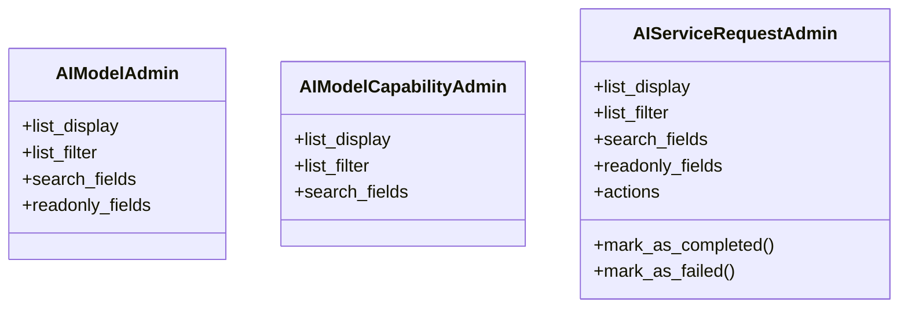

# integration_modules.ai_services.admin

## Imports
- django.contrib
- models

## Classes
- AIModelAdmin
  - attr: `list_display`
  - attr: `list_filter`
  - attr: `search_fields`
  - attr: `readonly_fields`
- AIModelCapabilityAdmin
  - attr: `list_display`
  - attr: `list_filter`
  - attr: `search_fields`
- AIServiceRequestAdmin
  - attr: `list_display`
  - attr: `list_filter`
  - attr: `search_fields`
  - attr: `readonly_fields`
  - attr: `actions`
  - method: `mark_as_completed`
  - method: `mark_as_failed`

## Functions
- mark_as_completed
- mark_as_failed

## Class Diagram

