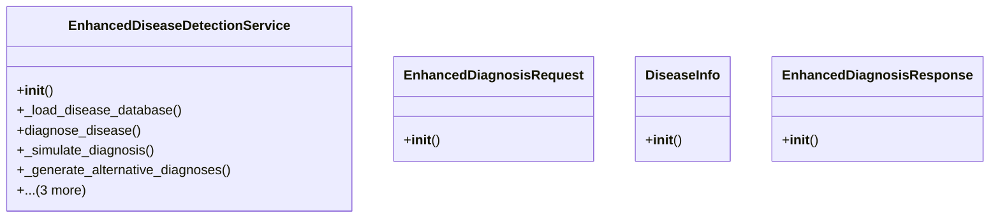

# integration_modules.ai_services.enhanced_ai_services

## Imports
- logging
- models.enhanced_ai_models
- os
- random
- time
- typing

## Classes
- EnhancedDiseaseDetectionService
  - method: `__init__`
  - method: `_load_disease_database`
  - method: `diagnose_disease`
  - method: `_simulate_diagnosis`
  - method: `_generate_alternative_diagnoses`
  - method: `get_available_diseases`
  - method: `get_disease_info`
  - method: `validate_image_path`
- EnhancedDiagnosisRequest
  - method: `__init__`
- DiseaseInfo
  - method: `__init__`
- EnhancedDiagnosisResponse
  - method: `__init__`

## Functions
- create_enhanced_disease_detection_service
- is_enhanced_services_available
- __init__
- _load_disease_database
- diagnose_disease
- _simulate_diagnosis
- _generate_alternative_diagnoses
- get_available_diseases
- get_disease_info
- validate_image_path
- __init__
- __init__
- __init__

## Module Variables
- `logger`
- `__all__`

## Class Diagram

