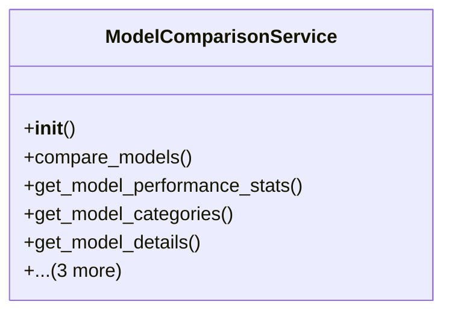

# integration_modules.ai_services.model_comparison_service

## Imports
- datetime
- django.db
- json
- logging
- models.detection_models
- os
- time
- typing
- uuid

## Classes
- ModelComparisonService
  - method: `__init__`
  - method: `compare_models`
  - method: `get_model_performance_stats`
  - method: `get_model_categories`
  - method: `get_model_details`
  - method: `get_available_models`
  - method: `is_model_available`
  - method: `run_batch_comparison`

## Functions
- is_comparison_service_available
- create_model_comparison_service
- __init__
- compare_models
- get_model_performance_stats
- get_model_categories
- get_model_details
- get_available_models
- is_model_available
- run_batch_comparison
- get_all_models

## Module Variables
- `logger`
- `model_comparison_service`
- `__all__`

## Class Diagram

