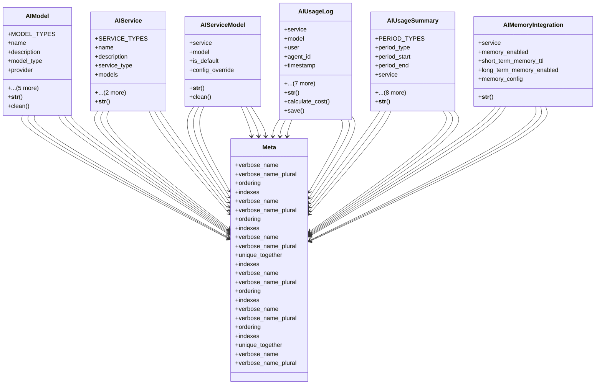

# integration_modules.ai_services.models

## Imports
- core_modules.base_models.models
- django.conf
- django.core.exceptions
- django.db
- django.utils
- django.utils.translation

## Classes
- AIModel
  - attr: `MODEL_TYPES`
  - attr: `name`
  - attr: `description`
  - attr: `model_type`
  - attr: `provider`
  - attr: `model_identifier`
  - attr: `is_active`
  - attr: `config`
  - attr: `cost_per_token`
  - attr: `usage_limit`
  - method: `__str__`
  - method: `clean`
- AIService
  - attr: `SERVICE_TYPES`
  - attr: `name`
  - attr: `description`
  - attr: `service_type`
  - attr: `models`
  - attr: `is_active`
  - attr: `config`
  - method: `__str__`
- AIServiceModel
  - attr: `service`
  - attr: `model`
  - attr: `is_default`
  - attr: `config_override`
  - method: `__str__`
  - method: `clean`
- AIUsageLog
  - attr: `service`
  - attr: `model`
  - attr: `user`
  - attr: `agent_id`
  - attr: `timestamp`
  - attr: `request_data`
  - attr: `response_data`
  - attr: `tokens_input`
  - attr: `tokens_output`
  - attr: `cost`
  - attr: `status`
  - attr: `error_message`
  - method: `__str__`
  - method: `calculate_cost`
  - method: `save`
- AIUsageSummary
  - attr: `PERIOD_TYPES`
  - attr: `period_type`
  - attr: `period_start`
  - attr: `period_end`
  - attr: `service`
  - attr: `model`
  - attr: `user`
  - attr: `request_count`
  - attr: `success_count`
  - attr: `error_count`
  - attr: `tokens_input`
  - attr: `tokens_output`
  - attr: `total_cost`
  - method: `__str__`
- AIMemoryIntegration
  - attr: `service`
  - attr: `memory_enabled`
  - attr: `short_term_memory_ttl`
  - attr: `long_term_memory_enabled`
  - attr: `memory_config`
  - method: `__str__`
- Meta
  - attr: `verbose_name`
  - attr: `verbose_name_plural`
  - attr: `ordering`
  - attr: `indexes`
- Meta
  - attr: `verbose_name`
  - attr: `verbose_name_plural`
  - attr: `ordering`
  - attr: `indexes`
- Meta
  - attr: `verbose_name`
  - attr: `verbose_name_plural`
  - attr: `unique_together`
  - attr: `indexes`
- Meta
  - attr: `verbose_name`
  - attr: `verbose_name_plural`
  - attr: `ordering`
  - attr: `indexes`
- Meta
  - attr: `verbose_name`
  - attr: `verbose_name_plural`
  - attr: `ordering`
  - attr: `indexes`
  - attr: `unique_together`
- Meta
  - attr: `verbose_name`
  - attr: `verbose_name_plural`

## Functions
- __str__
- clean
- __str__
- __str__
- clean
- __str__
- calculate_cost
- save
- __str__
- __str__

## Class Diagram

