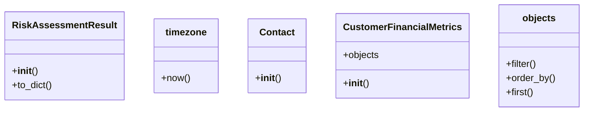

# integration_modules.ai_services.risk_assessment

## Imports
- accounting.models
- contacts.models
- datetime
- decimal
- django.db
- django.utils
- django.utils.translation
- logging
- typing

## Classes
- RiskAssessmentResult
  - method: `__init__`
  - method: `to_dict`
- timezone
  - method: `now`
- Contact
  - method: `__init__`
- CustomerFinancialMetrics
  - attr: `objects`
  - method: `__init__`
- objects
  - method: `filter`
  - method: `order_by`
  - method: `first`

## Functions
- gather_customer_data_for_risk_assessment
- assess_customer_credit_risk
- call_ai_model_api
- batch_assess_customers
- get_risk_thresholds
- update_risk_thresholds
- is_risk_assessment_available
- __init__
- to_dict
- _
- now
- __init__
- __init__
- filter
- order_by
- first

## Module Variables
- `logger`
- `RiskCategory`
- `__all__`

## Class Diagram

