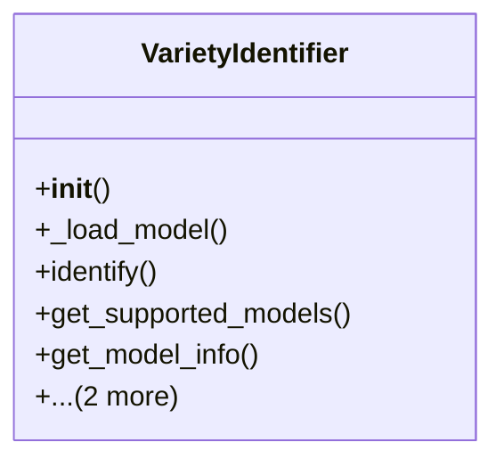

# integration_modules.ai_services.variety_identifier

## Imports
- PIL
- django.db
- logging
- os
- sys
- time
- torch
- torchvision
- traceback
- typing

## Classes
- VarietyIdentifier
  - method: `__init__`
  - method: `_load_model`
  - method: `identify`
  - method: `get_supported_models`
  - method: `get_model_info`
  - method: `identify_batch`
  - method: `get_top_predictions`

## Functions
- create_variety_identifier
- is_variety_identification_available
- get_available_models
- __init__
- _load_model
- identify
- get_supported_models
- get_model_info
- identify_batch
- get_top_predictions

## Module Variables
- `logger`
- `handler`
- `formatter`
- `__all__`

## Class Diagram

