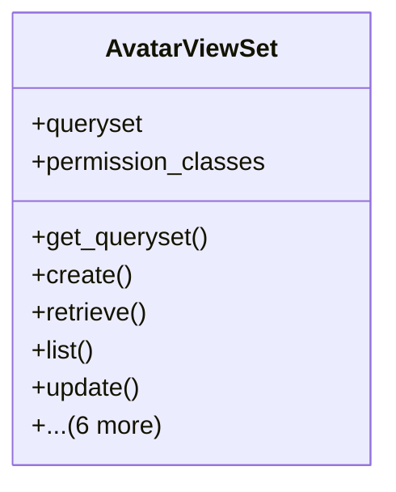

# integration_modules.ai_ui.api.avatar_api

## Imports
- django.shortcuts
- models
- rest_framework
- rest_framework.decorators
- rest_framework.response
- services.avatar_service

## Classes
- AvatarViewSet
  - attr: `queryset`
  - attr: `permission_classes`
  - method: `get_queryset`
  - method: `create`
  - method: `retrieve`
  - method: `list`
  - method: `update`
  - method: `destroy`
  - method: `record_interaction`
  - method: `interactions`
  - method: `_format_avatar_response`
  - method: `_format_avatar_basic_response`
  - method: `_format_interaction_response`

## Functions
- get_queryset
- create
- retrieve
- list
- update
- destroy
- record_interaction
- interactions
- _format_avatar_response
- _format_avatar_basic_response
- _format_interaction_response

## Class Diagram

