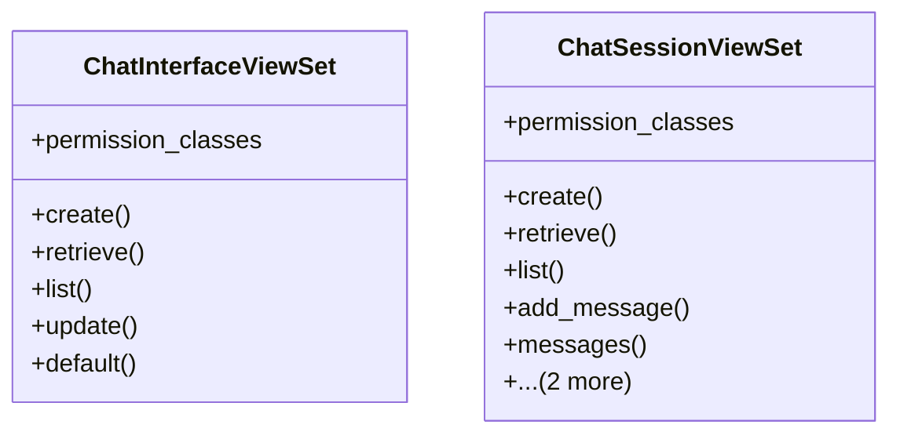

# integration_modules.ai_ui.api.chat_interface_api

## Imports
- django.db
- django.shortcuts
- models
- rest_framework
- rest_framework.decorators
- rest_framework.response
- services.chat_interface_service

## Classes
- ChatInterfaceViewSet
  - attr: `permission_classes`
  - method: `create`
  - method: `retrieve`
  - method: `list`
  - method: `update`
  - method: `default`
- ChatSessionViewSet
  - attr: `permission_classes`
  - method: `create`
  - method: `retrieve`
  - method: `list`
  - method: `add_message`
  - method: `messages`
  - method: `close`
  - method: `destroy`

## Functions
- create
- retrieve
- list
- update
- default
- create
- retrieve
- list
- add_message
- messages
- close
- destroy

## Class Diagram

