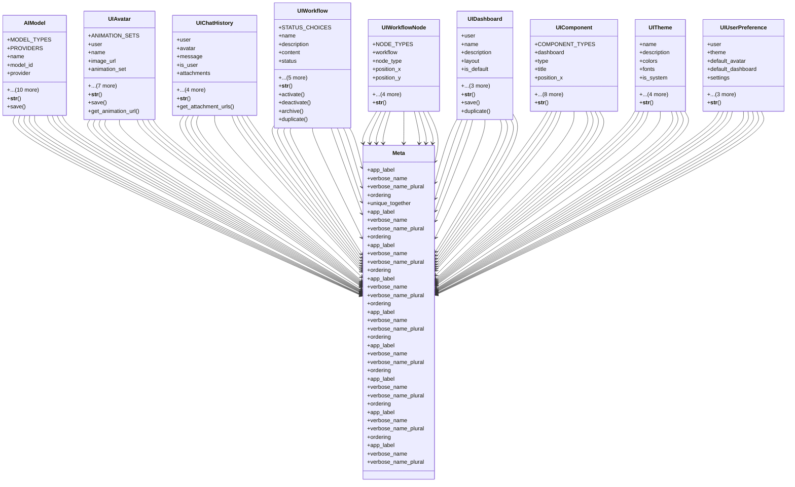

# integration_modules.ai_ui.models

## Imports
- django.conf
- django.core.validators
- django.db
- django.utils.translation

## Classes
- AIModel
  - attr: `MODEL_TYPES`
  - attr: `PROVIDERS`
  - attr: `name`
  - attr: `model_id`
  - attr: `provider`
  - attr: `model_type`
  - attr: `version`
  - attr: `description`
  - attr: `capabilities`
  - attr: `config`
  - attr: `api_key_name`
  - attr: `is_active`
  - attr: `is_default`
  - attr: `created_at`
  - attr: `updated_at`
  - method: `__str__`
  - method: `save`
- UIAvatar
  - attr: `ANIMATION_SETS`
  - attr: `user`
  - attr: `name`
  - attr: `image_url`
  - attr: `animation_set`
  - attr: `voice_id`
  - attr: `is_default`
  - attr: `custom_animations`
  - attr: `settings`
  - attr: `ai_model`
  - attr: `created_at`
  - attr: `updated_at`
  - method: `__str__`
  - method: `save`
  - method: `get_animation_url`
- UIChatHistory
  - attr: `user`
  - attr: `avatar`
  - attr: `message`
  - attr: `is_user`
  - attr: `attachments`
  - attr: `metadata`
  - attr: `created_at`
  - attr: `conversation_id`
  - attr: `ai_model`
  - method: `__str__`
  - method: `get_attachment_urls`
- UIWorkflow
  - attr: `STATUS_CHOICES`
  - attr: `name`
  - attr: `description`
  - attr: `content`
  - attr: `status`
  - attr: `created_by`
  - attr: `is_template`
  - attr: `is_public`
  - attr: `created_at`
  - attr: `updated_at`
  - method: `__str__`
  - method: `activate`
  - method: `deactivate`
  - method: `archive`
  - method: `duplicate`
- UIWorkflowNode
  - attr: `NODE_TYPES`
  - attr: `workflow`
  - attr: `node_type`
  - attr: `position_x`
  - attr: `position_y`
  - attr: `config`
  - attr: `created_at`
  - attr: `updated_at`
  - attr: `ai_model`
  - method: `__str__`
- UIDashboard
  - attr: `user`
  - attr: `name`
  - attr: `description`
  - attr: `layout`
  - attr: `is_default`
  - attr: `is_public`
  - attr: `created_at`
  - attr: `updated_at`
  - method: `__str__`
  - method: `save`
  - method: `duplicate`
- UIComponent
  - attr: `COMPONENT_TYPES`
  - attr: `dashboard`
  - attr: `type`
  - attr: `title`
  - attr: `position_x`
  - attr: `position_y`
  - attr: `size_x`
  - attr: `size_y`
  - attr: `config`
  - attr: `data_source`
  - attr: `refresh_interval`
  - attr: `created_at`
  - attr: `updated_at`
  - method: `__str__`
- UITheme
  - attr: `name`
  - attr: `description`
  - attr: `colors`
  - attr: `fonts`
  - attr: `is_system`
  - attr: `is_dark`
  - attr: `created_by`
  - attr: `created_at`
  - attr: `updated_at`
  - method: `__str__`
- UIUserPreference
  - attr: `user`
  - attr: `theme`
  - attr: `default_avatar`
  - attr: `default_dashboard`
  - attr: `settings`
  - attr: `created_at`
  - attr: `updated_at`
  - attr: `default_ai_model`
  - method: `__str__`
- Meta
  - attr: `app_label`
  - attr: `verbose_name`
  - attr: `verbose_name_plural`
  - attr: `ordering`
  - attr: `unique_together`
- Meta
  - attr: `app_label`
  - attr: `verbose_name`
  - attr: `verbose_name_plural`
  - attr: `ordering`
- Meta
  - attr: `app_label`
  - attr: `verbose_name`
  - attr: `verbose_name_plural`
  - attr: `ordering`
- Meta
  - attr: `app_label`
  - attr: `verbose_name`
  - attr: `verbose_name_plural`
  - attr: `ordering`
- Meta
  - attr: `app_label`
  - attr: `verbose_name`
  - attr: `verbose_name_plural`
  - attr: `ordering`
- Meta
  - attr: `app_label`
  - attr: `verbose_name`
  - attr: `verbose_name_plural`
  - attr: `ordering`
- Meta
  - attr: `app_label`
  - attr: `verbose_name`
  - attr: `verbose_name_plural`
  - attr: `ordering`
- Meta
  - attr: `app_label`
  - attr: `verbose_name`
  - attr: `verbose_name_plural`
  - attr: `ordering`
- Meta
  - attr: `app_label`
  - attr: `verbose_name`
  - attr: `verbose_name_plural`

## Functions
- __str__
- save
- __str__
- save
- get_animation_url
- __str__
- get_attachment_urls
- __str__
- activate
- deactivate
- archive
- duplicate
- __str__
- __str__
- save
- duplicate
- __str__
- __str__
- __str__

## Class Diagram

