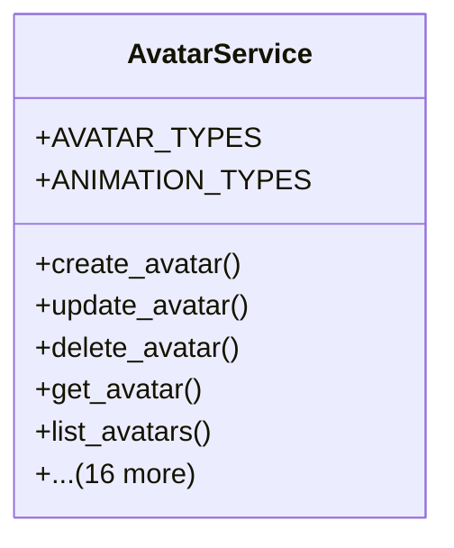

# integration_modules.ai_ui.services.avatar_service

## Imports
- base64
- django.contrib.auth
- django.core.exceptions
- django.db
- django.utils
- importlib
- json
- logging
- models
- os
- uuid

## Classes
- AvatarService
  - attr: `AVATAR_TYPES`
  - attr: `ANIMATION_TYPES`
  - method: `create_avatar`
  - method: `update_avatar`
  - method: `delete_avatar`
  - method: `get_avatar`
  - method: `list_avatars`
  - method: `add_animation`
  - method: `delete_animation`
  - method: `get_animation`
  - method: `set_user_avatar_preference`
  - method: `delete_user_avatar_preference`
  - method: `get_user_avatar_preference`
  - method: `_create_default_animations`
  - method: `_save_avatar_image`
  - method: `_log_activity`
  - method: `get_ai_models`
  - method: `create_ai_model`
  - method: `update_ai_model`
  - method: `delete_ai_model`
  - method: `get_ai_model`
  - method: `get_default_ai_model`
  - method: `load_ai_model_instance`

## Functions
- create_avatar
- update_avatar
- delete_avatar
- get_avatar
- list_avatars
- add_animation
- delete_animation
- get_animation
- set_user_avatar_preference
- delete_user_avatar_preference
- get_user_avatar_preference
- _create_default_animations
- _save_avatar_image
- _log_activity
- get_ai_models
- create_ai_model
- update_ai_model
- delete_ai_model
- get_ai_model
- get_default_ai_model
- load_ai_model_instance

## Module Variables
- `User`
- `logger`

## Class Diagram

